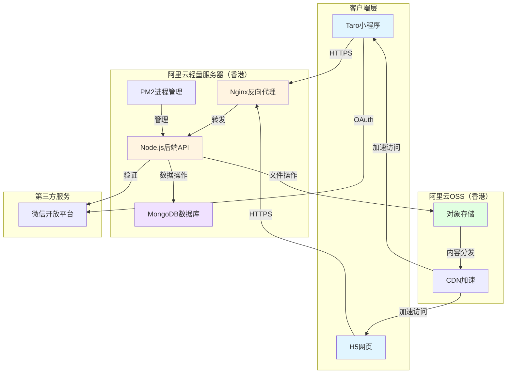
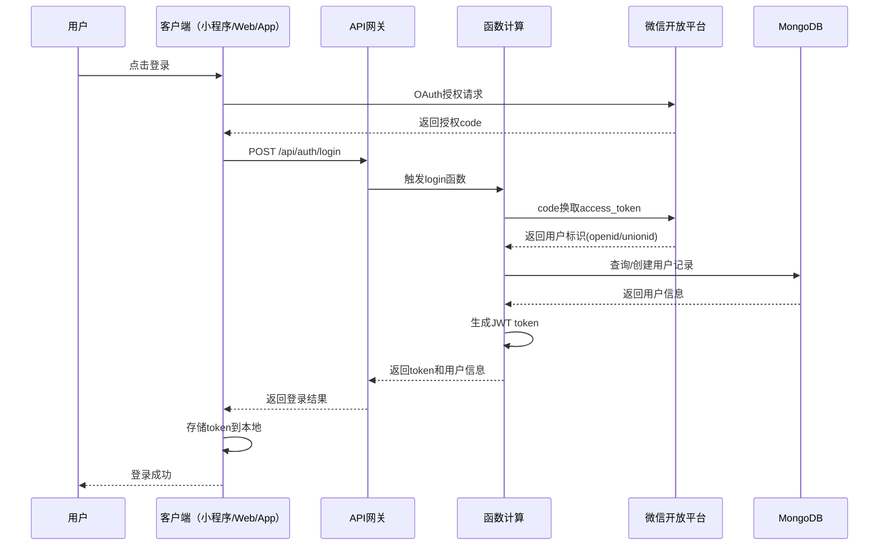
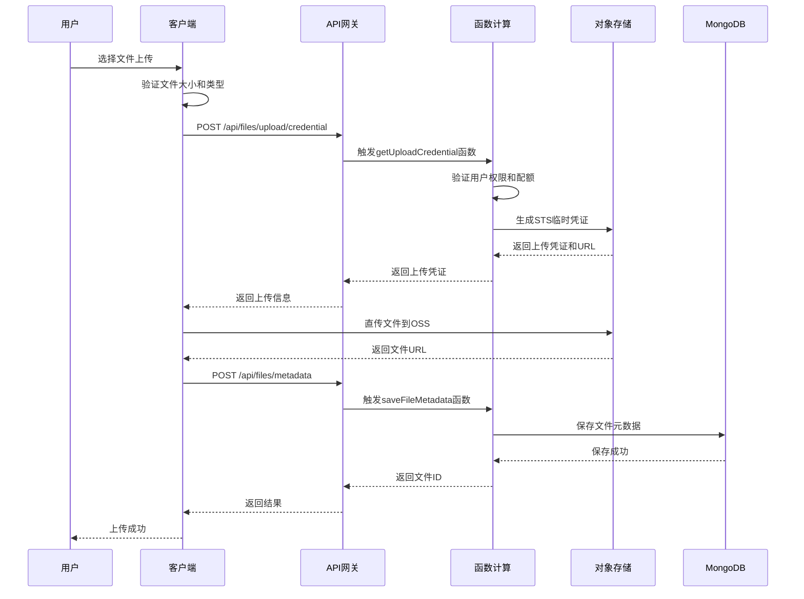
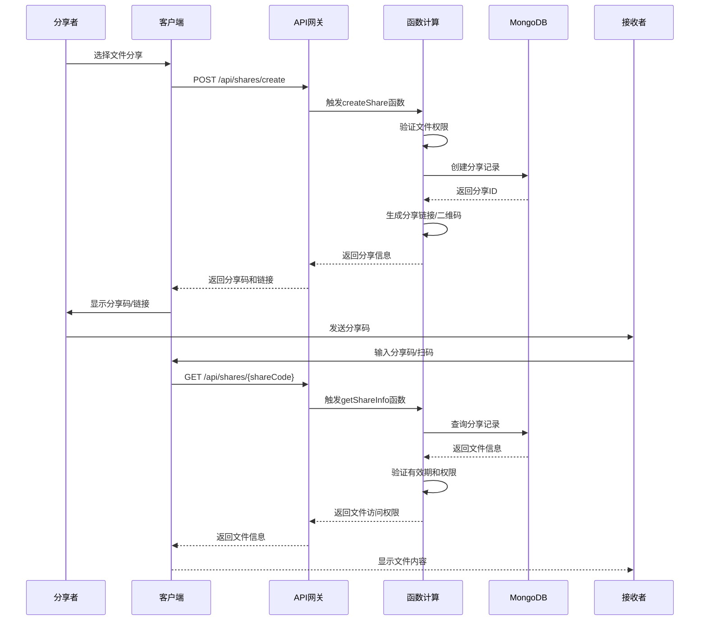

# 设计文档：微信小程序NAS系统

## 概述

本系统是一个面向公司内部使用（小于50人）的微信小程序NAS（网络附加存储）系统。系统提供基本的文件读写功能、文件分享功能和用户权限管理功能。采用微信小程序作为前端，云服务作为后端，实现轻量级、易用的企业文件管理解决方案。

系统设计遵循微服务架构理念，前后端分离，通过RESTful API进行通信。后端采用云原生架构，充分利用云服务提供商的托管服务，降低运维成本。存储层采用对象存储服务，确保文件的高可用性和可扩展性。

## 云服务提供商选型分析

### 阿里云 vs 腾讯云对比

#### 1. 跨平台扩展性

**阿里云（推荐）**
- 标准化的RESTful API，易于对接多端（小程序、Web、App）
- 服务解耦，可独立扩展各个模块
- 丰富的SDK支持（Node.js、Java、Python、Go等）
- 完善的API网关，统一管理多端接口
- 便于未来迁移到其他云平台

**腾讯云**
- 微信小程序云开发与腾讯云深度绑定
- 扩展到其他平台需要重构后端架构
- 云开发模式不适合多端场景
- 迁移成本高

**结论**：阿里云在跨平台扩展性上具有明显优势。

#### 2. 香港节点支持（免备案）

**阿里云**
- ✅ 香港节点成熟稳定，覆盖全面
- ✅ OSS香港存储：0.148元/GB/月
- ✅ ECS香港服务器：多种规格可选
- ✅ 香港CDN加速：覆盖亚太地区
- ✅ 无需备案，即开即用
- ✅ 访问速度：大陆地区延迟约30-50ms

**腾讯云**
- ⚠️ 香港节点支持有限
- ⚠️ 微信小程序云开发主要在国内节点
- ⚠️ 使用香港节点需要切换到标准云服务
- ⚠️ 配置相对复杂

**结论**：阿里云香港节点更成熟，免备案方案更完善。

#### 3. 成本分析（50人规模，香港节点）

**阿里云（香港）**
- 对象存储OSS（香港）：0.148元/GB/月
- 函数计算FC：0.0000167元/GB·秒
- API网关：0.06元/万次调用
- ECS轻量服务器（可选）：24元/月起
- 预估月成本：300-500元
- 按量付费，成本可控

**腾讯云（香港）**
- 需要使用标准云服务（非云开发）
- COS（香港）：0.156元/GB/月
- SCF：0.0000167元/GB·秒
- API网关：0.06元/万次调用
- 预估月成本：350-550元

**结论**：阿里云香港节点性价比更高。

#### 4. 技术架构对比

**阿里云架构（推荐）**
```
客户端（小程序/Web/App） → API网关 → 函数计算（FC） → RDS/MongoDB + OSS
```
- 优势：标准化架构，易于扩展多端，服务解耦
- 优势：可平滑迁移到其他云平台
- 优势：香港节点免备案
- 劣势：初期配置相对复杂

**腾讯云架构**
```
微信小程序 → 云函数（SCF） → 云数据库（MongoDB） + 云存储（COS）
```
- 优势：微信小程序集成度高
- 劣势：与腾讯云深度绑定，扩展到其他平台困难
- 劣势：香港节点支持有限

#### 5. 功能特性对比

| 功能 | 阿里云 | 腾讯云 |
|------|--------|--------|
| 跨平台支持 | ✅ 标准API，易扩展 | ⚠️ 小程序专用 |
| 香港节点 | ✅ 成熟稳定 | ⚠️ 支持有限 |
| 免备案 | ✅ 完善支持 | ⚠️ 需切换架构 |
| 文件存储 | ✅ OSS（香港） | ✅ COS |
| 数据库 | ✅ RDS/MongoDB | ✅ MongoDB |
| 无服务器函数 | ✅ 函数计算（FC） | ✅ 云函数（SCF） |
| CDN加速 | ✅ 全球CDN | ✅ 支持 |
| API网关 | ✅ 功能强大 | ✅ 支持 |
| 微信登录 | ✅ 标准OAuth | ✅ 原生集成 |
| 开发工具 | ✅ 丰富的SDK | ✅ 云开发工具 |
| 文档和社区 | ✅ 完善的文档 | ✅ 微信专用文档 |
| 未来扩展性 | ✅ 易于扩展 | ⚠️ 受限 |

#### 6. 最终推荐

**推荐使用阿里云（香港节点）**，理由如下：
1. **跨平台扩展**：标准化架构，未来可轻松扩展到Web、App等平台
2. **免备案**：香港节点无需备案，即开即用
3. **成熟稳定**：阿里云香港节点运营多年，稳定性高
4. **性价比高**：香港节点价格合理，按量付费灵活
5. **易于迁移**：标准API设计，未来可平滑迁移到其他云平台
6. **服务解耦**：各模块独立，便于维护和升级

**架构优势**：
- 采用标准RESTful API，前后端完全分离
- 微信登录通过标准OAuth 2.0实现，不依赖特定云平台
- 数据库使用标准MongoDB协议，迁移成本低
- 对象存储使用S3兼容API，可无缝切换到其他云平台

**香港节点优势**：
- 无需备案，节省时间和成本
- 访问速度：大陆地区延迟30-50ms，可接受
- 数据合规：适合国际化业务
- CDN加速：可覆盖亚太地区


## 系统架构

### 整体架构图



### 技术栈选型

**前端**
- 跨端框架：Taro 3.x + React 18
- UI组件库：Taro UI / NutUI
- 状态管理：Zustand / Redux Toolkit
- 网络请求：Taro.request / Axios
- 样式方案：CSS Modules / Styled Components
- 支持平台：微信小程序、H5、支付宝小程序等

**后端（阿里云轻量服务器）**
- 运行环境：Node.js 18.x
- Web框架：Express.js / Koa.js
- 数据库：MongoDB 6.x（自建或云数据库）
- 对象存储：阿里云OSS（香港）
- 进程管理：PM2
- 反向代理：Nginx
- 部署方式：Docker / 直接部署

**开发工具**
- 微信开发者工具
- 阿里云控制台
- Serverless Devs（函数计算开发工具）
- VS Code + 阿里云插件
- Postman（API测试）

## 主要业务流程

### 用户登录流程



### 文件上传流程



### 文件分享流程




## 组件和接口

### 前端组件架构

#### 1. 页面组件

**FileListPage（文件列表页）**

功能：展示用户的文件列表，支持文件夹导航

```javascript
interface FileListPage {
  data: {
    fileList: File[]
    currentPath: string
    loading: boolean
    hasMore: boolean
  }
  
  methods: {
    onLoad(): void
    loadFileList(path: string): Promise<void>
    onFileClick(fileId: string): void
    onUploadClick(): void
    onRefresh(): void
    onLoadMore(): void
  }
}
```

**FileDetailPage（文件详情页）**

功能：展示文件详细信息，支持预览、下载、分享、删除

```javascript
interface FileDetailPage {
  data: {
    file: FileDetail
    previewUrl: string
    shareInfo: ShareInfo | null
  }
  
  methods: {
    onLoad(fileId: string): void
    loadFileDetail(fileId: string): Promise<void>
    onPreview(): void
    onDownload(): void
    onShare(): void
    onDelete(): void
    onRename(): void
  }
}
```

**UploadPage（上传页）**

功能：文件上传，支持多文件选择、进度显示

```javascript
interface UploadPage {
  data: {
    selectedFiles: LocalFile[]
    uploadProgress: Map<string, number>
    targetFolder: string
  }
  
  methods: {
    onChooseFile(): void
    onStartUpload(): void
    uploadFile(file: LocalFile): Promise<string>
    onCancelUpload(fileId: string): void
  }
}
```

**ShareManagePage（分享管理页）**

功能：管理文件分享，查看分享记录

```javascript
interface ShareManagePage {
  data: {
    shareList: ShareRecord[]
    activeShares: number
    expiredShares: number
  }
  
  methods: {
    onLoad(): void
    loadShareList(): Promise<void>
    onCreateShare(fileId: string): void
    onRevokeShare(shareId: string): void
    onCopyShareLink(shareId: string): void
  }
}
```

**UserManagePage（用户管理页）**

功能：管理用户权限（仅管理员可见）

```javascript
interface UserManagePage {
  data: {
    userList: User[]
    roleFilter: string
  }
  
  methods: {
    onLoad(): void
    loadUserList(): Promise<void>
    onChangeUserRole(userId: string, role: string): void
    onToggleUserStatus(userId: string): void
  }
}
```

#### 2. 通用组件

**FileItem（文件项组件）**

```javascript
interface FileItem {
  properties: {
    file: File
    selectable: boolean
    selected: boolean
  }
  
  methods: {
    onTap(): void
    onLongPress(): void
    onSelectChange(selected: boolean): void
  }
}
```

**UploadProgress（上传进度组件）**

```javascript
interface UploadProgress {
  properties: {
    fileName: string
    progress: number
    status: 'uploading' | 'success' | 'failed'
  }
  
  methods: {
    onCancel(): void
    onRetry(): void
  }
}
```

### 后端API接口

#### API设计原则

- 采用RESTful风格
- 统一使用HTTPS协议
- 所有接口需要JWT token认证（除登录接口）
- 统一响应格式：`{ success: boolean, data?: any, error?: { code: string, message: string } }`
- API版本控制：`/api/v1/...`

#### 1. 用户认证模块

**POST /api/v1/auth/login（用户登录）**

```javascript
interface LoginAPI {
  request: {
    method: 'POST'
    path: '/api/v1/auth/login'
    body: {
      platform: 'wechat' | 'web' | 'app'
      code: string  // OAuth授权码
    }
  }
  
  response: {
    success: boolean
    data?: {
      token: string
      userId: string
      userInfo: {
        nickname: string
        avatar: string
        role: 'admin' | 'user'
        storageUsed: number
        storageQuota: number
      }
      expiresIn: number
    }
    error?: {
      code: 'INVALID_CODE' | 'USER_DISABLED' | 'PLATFORM_NOT_SUPPORTED'
      message: string
    }
  }
}
```

**GET /api/v1/auth/userinfo（获取用户信息）**

```javascript
interface GetUserInfoAPI {
  request: {
    method: 'GET'
    path: '/api/v1/auth/userinfo'
    headers: {
      Authorization: 'Bearer {token}'
    }
  }
  
  response: {
    success: boolean
    data?: {
      userId: string
      nickname: string
      avatar: string
      role: 'admin' | 'user'
      storageUsed: number
      storageQuota: number
    }
    error?: {
      code: 'INVALID_TOKEN' | 'TOKEN_EXPIRED'
      message: string
    }
  }
}
```

#### 2. 文件管理模块

**GET /api/v1/files（获取文件列表）**

```javascript
interface GetFileListAPI {
  request: {
    method: 'GET'
    path: '/api/v1/files'
    headers: {
      Authorization: 'Bearer {token}'
    }
    query: {
      path?: string
      page?: number
      pageSize?: number
      sortBy?: 'name' | 'time' | 'size'
      sortOrder?: 'asc' | 'desc'
    }
  }
  
  response: {
    success: boolean
    data?: {
      files: File[]
      total: number
      hasMore: boolean
    }
    error?: {
      code: 'UNAUTHORIZED' | 'INVALID_PATH'
      message: string
    }
  }
}
```

**GET /api/v1/files/:fileId（获取文件详情）**

```javascript
interface GetFileDetailAPI {
  request: {
    method: 'GET'
    path: '/api/v1/files/:fileId'
    headers: {
      Authorization: 'Bearer {token}'
    }
  }
  
  response: {
    success: boolean
    data?: {
      fileId: string
      fileName: string
      fileSize: number
      fileType: string
      downloadUrl: string
      previewUrl: string
      uploadTime: number
      uploaderId: string
      uploaderName: string
      permissions: FilePermission[]
    }
    error?: {
      code: 'FILE_NOT_FOUND' | 'PERMISSION_DENIED'
      message: string
    }
  }
}
```

**POST /api/v1/files/upload/credential（获取上传凭证）**

```javascript
interface GetUploadCredentialAPI {
  request: {
    method: 'POST'
    path: '/api/v1/files/upload/credential'
    headers: {
      Authorization: 'Bearer {token}'
    }
    body: {
      fileName: string
      fileSize: number
      fileType: string
      targetPath: string
    }
  }
  
  response: {
    success: boolean
    data?: {
      uploadUrl: string
      uploadToken: string
      fileId: string
      expiresIn: number
      ossConfig: {
        region: string
        bucket: string
        accessKeyId: string
        accessKeySecret: string
        stsToken: string
      }
    }
    error?: {
      code: 'QUOTA_EXCEEDED' | 'INVALID_FILE_TYPE' | 'FILE_TOO_LARGE'
      message: string
    }
  }
}
```

**POST /api/v1/files/metadata（保存文件元数据）**

```javascript
interface SaveFileMetadataAPI {
  request: {
    method: 'POST'
    path: '/api/v1/files/metadata'
    headers: {
      Authorization: 'Bearer {token}'
    }
    body: {
      fileId: string
      fileName: string
      fileSize: number
      fileType: string
      filePath: string
      fileUrl: string
    }
  }
  
  response: {
    success: boolean
    data?: {
      fileId: string
    }
    error?: {
      code: 'SAVE_FAILED'
      message: string
    }
  }
}
```

**DELETE /api/v1/files/:fileId（删除文件）**

```javascript
interface DeleteFileAPI {
  request: {
    method: 'DELETE'
    path: '/api/v1/files/:fileId'
    headers: {
      Authorization: 'Bearer {token}'
    }
  }
  
  response: {
    success: boolean
    error?: {
      code: 'FILE_NOT_FOUND' | 'PERMISSION_DENIED' | 'DELETE_FAILED'
      message: string
    }
  }
}
```

**PUT /api/v1/files/:fileId/rename（重命名文件）**

```javascript
interface RenameFileAPI {
  request: {
    method: 'PUT'
    path: '/api/v1/files/:fileId/rename'
    headers: {
      Authorization: 'Bearer {token}'
    }
    body: {
      newName: string
    }
  }
  
  response: {
    success: boolean
    data?: {
      newFileName: string
    }
    error?: {
      code: 'FILE_NOT_FOUND' | 'PERMISSION_DENIED' | 'NAME_CONFLICT'
      message: string
    }
  }
}
```

#### 3. 文件分享模块

**POST /api/v1/shares（创建分享）**

```javascript
interface CreateShareAPI {
  request: {
    method: 'POST'
    path: '/api/v1/shares'
    headers: {
      Authorization: 'Bearer {token}'
    }
    body: {
      fileId: string
      shareType: 'public' | 'password' | 'internal'
      password?: string
      expiresIn: number
      maxDownloads?: number
    }
  }
  
  response: {
    success: boolean
    data?: {
      shareId: string
      shareCode: string
      shareUrl: string
      qrCodeUrl: string
      expiresAt: number
    }
    error?: {
      code: 'FILE_NOT_FOUND' | 'PERMISSION_DENIED'
      message: string
    }
  }
}
```

**GET /api/v1/shares/:shareCode（获取分享信息）**

```javascript
interface GetShareInfoAPI {
  request: {
    method: 'GET'
    path: '/api/v1/shares/:shareCode'
    query: {
      password?: string
    }
    headers: {
      Authorization?: 'Bearer {token}'  // 内部分享需要
    }
  }
  
  response: {
    success: boolean
    data?: {
      shareId: string
      fileName: string
      fileSize: number
      fileType: string
      sharerName: string
      expiresAt: number
      downloadUrl: string
      previewUrl: string
    }
    error?: {
      code: 'SHARE_NOT_FOUND' | 'SHARE_EXPIRED' | 'INVALID_PASSWORD' | 'DOWNLOAD_LIMIT_REACHED'
      message: string
    }
  }
}
```

**DELETE /api/v1/shares/:shareId（撤销分享）**

```javascript
interface RevokeShareAPI {
  request: {
    method: 'DELETE'
    path: '/api/v1/shares/:shareId'
    headers: {
      Authorization: 'Bearer {token}'
    }
  }
  
  response: {
    success: boolean
    error?: {
      code: 'SHARE_NOT_FOUND' | 'PERMISSION_DENIED'
      message: string
    }
  }
}
```

**GET /api/v1/shares（获取分享列表）**

```javascript
interface GetShareListAPI {
  request: {
    method: 'GET'
    path: '/api/v1/shares'
    headers: {
      Authorization: 'Bearer {token}'
    }
    query: {
      status?: 'active' | 'expired' | 'all'
      page?: number
      pageSize?: number
    }
  }
  
  response: {
    success: boolean
    data?: {
      shares: ShareRecord[]
      total: number
      hasMore: boolean
    }
  }
}
```

#### 4. 权限管理模块

**GET /api/v1/users（获取用户列表）**

```javascript
interface GetUserListAPI {
  request: {
    method: 'GET'
    path: '/api/v1/users'
    headers: {
      Authorization: 'Bearer {token}'  // 需要管理员权限
    }
    query: {
      role?: string
      status?: 'active' | 'disabled'
      page?: number
      pageSize?: number
    }
  }
  
  response: {
    success: boolean
    data?: {
      users: User[]
      total: number
      hasMore: boolean
    }
    error?: {
      code: 'PERMISSION_DENIED'
      message: string
    }
  }
}
```

**PUT /api/v1/users/:userId/role（更新用户角色）**

```javascript
interface UpdateUserRoleAPI {
  request: {
    method: 'PUT'
    path: '/api/v1/users/:userId/role'
    headers: {
      Authorization: 'Bearer {token}'  // 需要管理员权限
    }
    body: {
      role: 'admin' | 'user'
    }
  }
  
  response: {
    success: boolean
    error?: {
      code: 'PERMISSION_DENIED' | 'USER_NOT_FOUND' | 'CANNOT_MODIFY_SELF'
      message: string
    }
  }
}
```

**PUT /api/v1/users/:userId/status（切换用户状态）**

```javascript
interface ToggleUserStatusAPI {
  request: {
    method: 'PUT'
    path: '/api/v1/users/:userId/status'
    headers: {
      Authorization: 'Bearer {token}'  // 需要管理员权限
    }
    body: {
      status: 'active' | 'disabled'
    }
  }
  
  response: {
    success: boolean
    error?: {
      code: 'PERMISSION_DENIED' | 'USER_NOT_FOUND' | 'CANNOT_DISABLE_SELF'
      message: string
    }
  }
}
```

**PUT /api/v1/files/:fileId/permissions（设置文件权限）**

```javascript
interface SetFilePermissionAPI {
  request: {
    method: 'PUT'
    path: '/api/v1/files/:fileId/permissions'
    headers: {
      Authorization: 'Bearer {token}'
    }
    body: {
      userId: string
      permission: 'read' | 'write' | 'admin' | 'none'
    }
  }
  
  response: {
    success: boolean
    error?: {
      code: 'FILE_NOT_FOUND' | 'USER_NOT_FOUND' | 'PERMISSION_DENIED'
      message: string
    }
  }
}
```


## 数据模型

### User（用户）

```javascript
interface User {
  _id: string
  openid: string
  unionid?: string
  nickname: string
  avatar: string
  role: 'admin' | 'user'
  status: 'active' | 'disabled'
  storageUsed: number
  storageQuota: number
  createdAt: number
  updatedAt: number
  lastLoginAt: number
}
```

**验证规则**：
- openid：必填，唯一索引
- nickname：必填，长度1-32字符
- role：必填，枚举值['admin', 'user']
- status：必填，枚举值['active', 'disabled']
- storageUsed：必填，非负整数，单位字节
- storageQuota：必填，正整数，默认5GB（5368709120字节）

**索引**：
- openid：唯一索引
- role：普通索引
- status：普通索引

### File（文件）

```javascript
interface File {
  _id: string
  fileName: string
  fileSize: number
  fileType: string
  filePath: string
  fileUrl: string
  thumbnailUrl?: string
  uploaderId: string
  uploaderName: string
  folderId?: string
  folderPath: string
  isFolder: boolean
  permissions: FilePermission[]
  tags: string[]
  downloadCount: number
  shareCount: number
  status: 'active' | 'deleted'
  createdAt: number
  updatedAt: number
  deletedAt?: number
}

interface FilePermission {
  userId: string
  permission: 'read' | 'write' | 'admin'
  grantedBy: string
  grantedAt: number
}
```

**验证规则**：
- fileName：必填，长度1-255字符，不能包含特殊字符 / \ : * ? " < > |
- fileSize：必填，非负整数
- fileType：必填，MIME类型格式
- filePath：必填，符合路径格式
- uploaderId：必填，关联User._id
- isFolder：必填，布尔值
- status：必填，枚举值['active', 'deleted']

**索引**：
- uploaderId：普通索引
- folderId：普通索引
- folderPath：普通索引
- status：普通索引
- createdAt：降序索引
- 复合索引：(uploaderId, status, createdAt)

### Share（分享）

```javascript
interface Share {
  _id: string
  shareCode: string
  fileId: string
  fileName: string
  sharerId: string
  sharerName: string
  shareType: 'public' | 'password' | 'internal'
  password?: string
  expiresAt: number
  maxDownloads?: number
  downloadCount: number
  accessLog: AccessLog[]
  status: 'active' | 'expired' | 'revoked'
  createdAt: number
  updatedAt: number
}

interface AccessLog {
  userId?: string
  accessTime: number
  ipAddress: string
  action: 'view' | 'download'
}
```

**验证规则**：
- shareCode：必填，唯一，8位随机字符串
- fileId：必填，关联File._id
- sharerId：必填，关联User._id
- shareType：必填，枚举值['public', 'password', 'internal']
- password：当shareType为'password'时必填，长度4-16字符
- expiresAt：必填，Unix时间戳
- maxDownloads：可选，正整数
- status：必填，枚举值['active', 'expired', 'revoked']

**索引**：
- shareCode：唯一索引
- fileId：普通索引
- sharerId：普通索引
- status：普通索引
- expiresAt：普通索引
- 复合索引：(status, expiresAt)

### Session（会话）

```javascript
interface Session {
  _id: string
  token: string
  userId: string
  openid: string
  sessionKey: string
  expiresAt: number
  createdAt: number
  lastAccessAt: number
}
```

**验证规则**：
- token：必填，唯一，JWT格式
- userId：必填，关联User._id
- openid：必填
- sessionKey：必填，微信session_key
- expiresAt：必填，Unix时间戳

**索引**：
- token：唯一索引
- userId：普通索引
- expiresAt：TTL索引（自动删除过期记录）

### OperationLog（操作日志）

```javascript
interface OperationLog {
  _id: string
  userId: string
  userName: string
  action: string
  resource: string
  resourceId: string
  details: object
  ipAddress: string
  userAgent: string
  status: 'success' | 'failed'
  errorMessage?: string
  createdAt: number
}
```

**验证规则**：
- userId：必填
- action：必填，如'upload', 'download', 'delete', 'share'等
- resource：必填，如'file', 'share', 'user'等
- status：必填，枚举值['success', 'failed']

**索引**：
- userId：普通索引
- action：普通索引
- createdAt：降序索引
- 复合索引：(userId, action, createdAt)


## 核心算法伪代码

### 用户认证算法

#### 算法1：用户登录

```pascal
ALGORITHM userLogin(code)
INPUT: code - 微信登录临时凭证
OUTPUT: LoginResult - 包含token和用户信息

前置条件：
  - code 非空且有效
  - 微信服务可访问

后置条件：
  - 返回有效的登录token
  - 用户信息已更新到数据库
  - Session记录已创建

BEGIN
  // 步骤1：向微信服务器换取openid和session_key
  wxResult ← callWeixinAPI("auth.code2Session", {
    appid: APP_ID,
    secret: APP_SECRET,
    js_code: code,
    grant_type: "authorization_code"
  })
  
  IF wxResult.errcode IS NOT NULL THEN
    RETURN Error("INVALID_CODE", "无效的登录凭证")
  END IF
  
  openid ← wxResult.openid
  sessionKey ← wxResult.session_key
  
  // 步骤2：查询或创建用户记录
  user ← database.users.findOne({ openid: openid })
  
  IF user IS NULL THEN
    // 新用户，创建记录
    user ← {
      openid: openid,
      nickname: "用户" + generateRandomString(6),
      avatar: DEFAULT_AVATAR_URL,
      role: "user",
      status: "active",
      storageUsed: 0,
      storageQuota: 5368709120,  // 5GB
      createdAt: currentTimestamp(),
      updatedAt: currentTimestamp(),
      lastLoginAt: currentTimestamp()
    }
    database.users.insert(user)
  ELSE
    // 已有用户，更新最后登录时间
    IF user.status = "disabled" THEN
      RETURN Error("USER_DISABLED", "用户已被禁用")
    END IF
    
    database.users.update(
      { _id: user._id },
      { 
        lastLoginAt: currentTimestamp(),
        updatedAt: currentTimestamp()
      }
    )
  END IF
  
  // 步骤3：生成JWT token
  tokenPayload ← {
    userId: user._id,
    openid: openid,
    role: user.role,
    exp: currentTimestamp() + 7 * 24 * 3600  // 7天有效期
  }
  token ← generateJWT(tokenPayload, JWT_SECRET)
  
  // 步骤4：保存session记录
  session ← {
    token: token,
    userId: user._id,
    openid: openid,
    sessionKey: sessionKey,
    expiresAt: currentTimestamp() + 7 * 24 * 3600,
    createdAt: currentTimestamp(),
    lastAccessAt: currentTimestamp()
  }
  database.sessions.insert(session)
  
  // 步骤5：返回登录结果
  RETURN Success({
    token: token,
    userId: user._id,
    userInfo: {
      nickname: user.nickname,
      avatar: user.avatar,
      role: user.role,
      storageUsed: user.storageUsed,
      storageQuota: user.storageQuota
    },
    expiresIn: 7 * 24 * 3600
  })
END

循环不变式：无（无循环）
```

#### 算法2：验证用户权限

```pascal
ALGORITHM verifyUserPermission(token, requiredRole)
INPUT: 
  - token: 用户登录凭证
  - requiredRole: 所需角色 ('user' 或 'admin')
OUTPUT: VerifyResult - 包含用户信息或错误

前置条件：
  - token 非空
  - requiredRole 为有效角色值

后置条件：
  - 返回验证结果
  - 如果成功，返回用户信息
  - 如果失败，返回错误信息

BEGIN
  // 步骤1：验证JWT token
  TRY
    payload ← verifyJWT(token, JWT_SECRET)
  CATCH JWTExpiredError
    RETURN Error("TOKEN_EXPIRED", "登录态已过期")
  CATCH JWTInvalidError
    RETURN Error("INVALID_TOKEN", "无效的登录态")
  END TRY
  
  // 步骤2：检查token是否在有效session中
  session ← database.sessions.findOne({ 
    token: token,
    expiresAt: { $gt: currentTimestamp() }
  })
  
  IF session IS NULL THEN
    RETURN Error("TOKEN_EXPIRED", "登录态已过期")
  END IF
  
  // 步骤3：获取用户信息
  user ← database.users.findOne({ _id: payload.userId })
  
  IF user IS NULL THEN
    RETURN Error("USER_NOT_FOUND", "用户不存在")
  END IF
  
  IF user.status = "disabled" THEN
    RETURN Error("USER_DISABLED", "用户已被禁用")
  END IF
  
  // 步骤4：验证角色权限
  IF requiredRole = "admin" AND user.role ≠ "admin" THEN
    RETURN Error("PERMISSION_DENIED", "需要管理员权限")
  END IF
  
  // 步骤5：更新session最后访问时间
  database.sessions.update(
    { _id: session._id },
    { lastAccessAt: currentTimestamp() }
  )
  
  // 步骤6：返回用户信息
  RETURN Success({
    userId: user._id,
    openid: user.openid,
    role: user.role,
    storageUsed: user.storageUsed,
    storageQuota: user.storageQuota
  })
END

循环不变式：无（无循环）
```

### 文件管理算法

#### 算法3：文件上传流程

```pascal
ALGORITHM uploadFile(token, fileName, fileSize, fileType, targetPath)
INPUT:
  - token: 用户登录凭证
  - fileName: 文件名
  - fileSize: 文件大小（字节）
  - fileType: 文件MIME类型
  - targetPath: 目标路径
OUTPUT: UploadResult - 包含上传URL和文件ID

前置条件：
  - token 有效
  - fileName 符合命名规范
  - fileSize > 0 且 ≤ 100MB
  - targetPath 有效

后置条件：
  - 返回有效的上传凭证
  - 用户存储空间已预留
  - 文件元数据已创建

BEGIN
  // 步骤1：验证用户权限
  userInfo ← verifyUserPermission(token, "user")
  IF userInfo IS Error THEN
    RETURN userInfo
  END IF
  
  // 步骤2：验证文件名
  IF NOT isValidFileName(fileName) THEN
    RETURN Error("INVALID_FILE_NAME", "文件名包含非法字符")
  END IF
  
  // 步骤3：验证文件大小
  MAX_FILE_SIZE ← 104857600  // 100MB
  IF fileSize > MAX_FILE_SIZE THEN
    RETURN Error("FILE_TOO_LARGE", "文件大小超过100MB限制")
  END IF
  
  // 步骤4：检查存储空间
  IF userInfo.storageUsed + fileSize > userInfo.storageQuota THEN
    RETURN Error("QUOTA_EXCEEDED", "存储空间不足")
  END IF
  
  // 步骤5：验证文件类型
  allowedTypes ← [
    "image/jpeg", "image/png", "image/gif",
    "application/pdf", "application/msword",
    "application/vnd.ms-excel", "text/plain",
    "video/mp4", "audio/mpeg"
  ]
  IF fileType NOT IN allowedTypes THEN
    RETURN Error("INVALID_FILE_TYPE", "不支持的文件类型")
  END IF
  
  // 步骤6：生成文件ID和存储路径
  fileId ← generateUUID()
  fileExtension ← extractExtension(fileName)
  storagePath ← "files/" + userInfo.userId + "/" + fileId + fileExtension
  
  // 步骤7：生成COS上传凭证
  uploadCredential ← generateCOSUploadCredential({
    bucket: COS_BUCKET,
    region: COS_REGION,
    path: storagePath,
    maxSize: fileSize,
    expiresIn: 3600  // 1小时有效
  })
  
  // 步骤8：创建文件元数据记录（状态为pending）
  fileMetadata ← {
    _id: fileId,
    fileName: fileName,
    fileSize: fileSize,
    fileType: fileType,
    filePath: storagePath,
    fileUrl: "",  // 上传完成后更新
    uploaderId: userInfo.userId,
    uploaderName: userInfo.nickname,
    folderPath: targetPath,
    isFolder: false,
    permissions: [{
      userId: userInfo.userId,
      permission: "admin",
      grantedBy: userInfo.userId,
      grantedAt: currentTimestamp()
    }],
    tags: [],
    downloadCount: 0,
    shareCount: 0,
    status: "pending",
    createdAt: currentTimestamp(),
    updatedAt: currentTimestamp()
  }
  database.files.insert(fileMetadata)
  
  // 步骤9：预留存储空间
  database.users.update(
    { _id: userInfo.userId },
    { $inc: { storageUsed: fileSize } }
  )
  
  // 步骤10：返回上传凭证
  RETURN Success({
    uploadUrl: uploadCredential.url,
    uploadToken: uploadCredential.token,
    fileId: fileId,
    expiresIn: 3600
  })
END

循环不变式：无（无循环）
```

#### 算法4：保存文件元数据

```pascal
ALGORITHM saveFileMetadata(token, fileId, fileUrl)
INPUT:
  - token: 用户登录凭证
  - fileId: 文件ID
  - fileUrl: 文件在COS的URL
OUTPUT: SaveResult - 成功或失败

前置条件：
  - token 有效
  - fileId 存在且状态为pending
  - fileUrl 有效

后置条件：
  - 文件状态更新为active
  - 文件URL已保存
  - 操作日志已记录

BEGIN
  // 步骤1：验证用户权限
  userInfo ← verifyUserPermission(token, "user")
  IF userInfo IS Error THEN
    RETURN userInfo
  END IF
  
  // 步骤2：查询文件记录
  file ← database.files.findOne({ _id: fileId })
  
  IF file IS NULL THEN
    RETURN Error("FILE_NOT_FOUND", "文件不存在")
  END IF
  
  IF file.uploaderId ≠ userInfo.userId THEN
    RETURN Error("PERMISSION_DENIED", "无权限操作此文件")
  END IF
  
  IF file.status ≠ "pending" THEN
    RETURN Error("INVALID_STATUS", "文件状态异常")
  END IF
  
  // 步骤3：验证文件URL
  IF NOT isValidCOSUrl(fileUrl) THEN
    RETURN Error("INVALID_URL", "无效的文件URL")
  END IF
  
  // 步骤4：生成缩略图（如果是图片）
  thumbnailUrl ← NULL
  IF file.fileType STARTS WITH "image/" THEN
    thumbnailUrl ← generateThumbnail(fileUrl, {
      width: 200,
      height: 200,
      quality: 80
    })
  END IF
  
  // 步骤5：更新文件记录
  database.files.update(
    { _id: fileId },
    {
      fileUrl: fileUrl,
      thumbnailUrl: thumbnailUrl,
      status: "active",
      updatedAt: currentTimestamp()
    }
  )
  
  // 步骤6：记录操作日志
  logOperation({
    userId: userInfo.userId,
    userName: userInfo.nickname,
    action: "upload",
    resource: "file",
    resourceId: fileId,
    details: {
      fileName: file.fileName,
      fileSize: file.fileSize
    },
    status: "success"
  })
  
  // 步骤7：返回成功结果
  RETURN Success({
    success: true,
    fileId: fileId
  })
END

循环不变式：无（无循环）
```

#### 算法5：文件权限检查

```pascal
ALGORITHM checkFilePermission(userId, fileId, requiredPermission)
INPUT:
  - userId: 用户ID
  - fileId: 文件ID
  - requiredPermission: 所需权限 ('read', 'write', 'admin')
OUTPUT: Boolean - 是否有权限

前置条件：
  - userId 非空
  - fileId 存在
  - requiredPermission 为有效值

后置条件：
  - 返回权限检查结果

BEGIN
  // 步骤1：获取用户信息
  user ← database.users.findOne({ _id: userId })
  IF user IS NULL THEN
    RETURN false
  END IF
  
  // 步骤2：管理员拥有所有权限
  IF user.role = "admin" THEN
    RETURN true
  END IF
  
  // 步骤3：获取文件信息
  file ← database.files.findOne({ _id: fileId })
  IF file IS NULL THEN
    RETURN false
  END IF
  
  // 步骤4：文件所有者拥有所有权限
  IF file.uploaderId = userId THEN
    RETURN true
  END IF
  
  // 步骤5：检查文件权限列表
  FOR EACH permission IN file.permissions DO
    IF permission.userId = userId THEN
      // 权限等级：admin > write > read
      IF requiredPermission = "read" THEN
        RETURN true
      ELSE IF requiredPermission = "write" THEN
        RETURN permission.permission IN ["write", "admin"]
      ELSE IF requiredPermission = "admin" THEN
        RETURN permission.permission = "admin"
      END IF
    END IF
  END FOR
  
  // 步骤6：无权限
  RETURN false
END

循环不变式：
  - 遍历permissions数组时，已检查的权限记录不满足条件
  - 如果找到匹配的userId，立即返回结果
```


### 文件分享算法

#### 算法6：创建文件分享

```pascal
ALGORITHM createFileShare(token, fileId, shareType, password, expiresIn, maxDownloads)
INPUT:
  - token: 用户登录凭证
  - fileId: 文件ID
  - shareType: 分享类型 ('public', 'password', 'internal')
  - password: 分享密码（可选）
  - expiresIn: 有效期（秒）
  - maxDownloads: 最大下载次数（可选）
OUTPUT: ShareResult - 包含分享码和分享链接

前置条件：
  - token 有效
  - fileId 存在
  - shareType 为有效值
  - 如果shareType为'password'，则password非空
  - expiresIn > 0

后置条件：
  - 创建分享记录
  - 返回分享码和链接
  - 文件分享计数增加

BEGIN
  // 步骤1：验证用户权限
  userInfo ← verifyUserPermission(token, "user")
  IF userInfo IS Error THEN
    RETURN userInfo
  END IF
  
  // 步骤2：检查文件权限
  hasPermission ← checkFilePermission(userInfo.userId, fileId, "read")
  IF NOT hasPermission THEN
    RETURN Error("PERMISSION_DENIED", "无权限分享此文件")
  END IF
  
  // 步骤3：获取文件信息
  file ← database.files.findOne({ _id: fileId, status: "active" })
  IF file IS NULL THEN
    RETURN Error("FILE_NOT_FOUND", "文件不存在或已删除")
  END IF
  
  // 步骤4：验证分享参数
  IF shareType = "password" AND (password IS NULL OR length(password) < 4) THEN
    RETURN Error("INVALID_PASSWORD", "密码长度至少4位")
  END IF
  
  MAX_EXPIRES_IN ← 30 * 24 * 3600  // 最长30天
  IF expiresIn > MAX_EXPIRES_IN THEN
    expiresIn ← MAX_EXPIRES_IN
  END IF
  
  // 步骤5：生成唯一分享码
  shareCode ← NULL
  maxRetries ← 10
  retryCount ← 0
  
  WHILE shareCode IS NULL AND retryCount < maxRetries DO
    candidateCode ← generateRandomString(8, "ALPHANUMERIC")
    existingShare ← database.shares.findOne({ shareCode: candidateCode })
    
    IF existingShare IS NULL THEN
      shareCode ← candidateCode
    END IF
    
    retryCount ← retryCount + 1
  END WHILE
  
  IF shareCode IS NULL THEN
    RETURN Error("GENERATE_CODE_FAILED", "生成分享码失败，请重试")
  END IF
  
  // 步骤6：创建分享记录
  shareId ← generateUUID()
  share ← {
    _id: shareId,
    shareCode: shareCode,
    fileId: fileId,
    fileName: file.fileName,
    sharerId: userInfo.userId,
    sharerName: userInfo.nickname,
    shareType: shareType,
    password: shareType = "password" ? hashPassword(password) : NULL,
    expiresAt: currentTimestamp() + expiresIn,
    maxDownloads: maxDownloads,
    downloadCount: 0,
    accessLog: [],
    status: "active",
    createdAt: currentTimestamp(),
    updatedAt: currentTimestamp()
  }
  database.shares.insert(share)
  
  // 步骤7：更新文件分享计数
  database.files.update(
    { _id: fileId },
    { $inc: { shareCount: 1 } }
  )
  
  // 步骤8：生成分享链接和二维码
  shareUrl ← MINI_PROGRAM_URL + "?scene=" + shareCode
  qrCodeUrl ← generateQRCode(shareUrl, {
    width: 280,
    autoColor: false,
    lineColor: {"r": 0, "g": 0, "b": 0}
  })
  
  // 步骤9：记录操作日志
  logOperation({
    userId: userInfo.userId,
    userName: userInfo.nickname,
    action: "create_share",
    resource: "share",
    resourceId: shareId,
    details: {
      fileId: fileId,
      fileName: file.fileName,
      shareType: shareType
    },
    status: "success"
  })
  
  // 步骤10：返回分享信息
  RETURN Success({
    shareId: shareId,
    shareCode: shareCode,
    shareUrl: shareUrl,
    qrCodeUrl: qrCodeUrl,
    expiresAt: share.expiresAt
  })
END

循环不变式（生成分享码循环）：
  - retryCount ≤ maxRetries
  - 如果shareCode仍为NULL，说明前retryCount次尝试都生成了重复的码
  - 每次迭代retryCount增加1
```

#### 算法7：访问文件分享

```pascal
ALGORITHM accessFileShare(shareCode, password, userId, action)
INPUT:
  - shareCode: 分享码
  - password: 分享密码（可选）
  - userId: 访问用户ID（可选，用于内部分享）
  - action: 操作类型 ('view' 或 'download')
OUTPUT: ShareAccessResult - 包含文件信息和访问URL

前置条件：
  - shareCode 非空
  - action 为有效值

后置条件：
  - 返回文件访问信息
  - 访问日志已记录
  - 下载计数已更新（如果是下载操作）

BEGIN
  // 步骤1：查询分享记录
  share ← database.shares.findOne({ shareCode: shareCode })
  
  IF share IS NULL THEN
    RETURN Error("SHARE_NOT_FOUND", "分享不存在")
  END IF
  
  // 步骤2：检查分享状态
  IF share.status = "revoked" THEN
    RETURN Error("SHARE_REVOKED", "分享已被撤销")
  END IF
  
  IF share.status = "expired" OR share.expiresAt < currentTimestamp() THEN
    // 自动更新过期状态
    IF share.status ≠ "expired" THEN
      database.shares.update(
        { _id: share._id },
        { status: "expired" }
      )
    END IF
    RETURN Error("SHARE_EXPIRED", "分享已过期")
  END IF
  
  // 步骤3：检查下载次数限制
  IF share.maxDownloads IS NOT NULL AND share.downloadCount ≥ share.maxDownloads THEN
    RETURN Error("DOWNLOAD_LIMIT_REACHED", "下载次数已达上限")
  END IF
  
  // 步骤4：验证分享类型和权限
  IF share.shareType = "password" THEN
    IF password IS NULL THEN
      RETURN Error("PASSWORD_REQUIRED", "需要输入密码")
    END IF
    
    IF NOT verifyPassword(password, share.password) THEN
      RETURN Error("INVALID_PASSWORD", "密码错误")
    END IF
  ELSE IF share.shareType = "internal" THEN
    IF userId IS NULL THEN
      RETURN Error("LOGIN_REQUIRED", "需要登录访问")
    END IF
    
    // 检查用户是否在公司内部（已注册用户）
    user ← database.users.findOne({ _id: userId })
    IF user IS NULL THEN
      RETURN Error("PERMISSION_DENIED", "仅限公司内部人员访问")
    END IF
  END IF
  
  // 步骤5：获取文件信息
  file ← database.files.findOne({ _id: share.fileId, status: "active" })
  
  IF file IS NULL THEN
    RETURN Error("FILE_NOT_FOUND", "文件不存在或已删除")
  END IF
  
  // 步骤6：生成临时访问URL
  accessUrl ← NULL
  IF action = "download" THEN
    accessUrl ← generateCOSDownloadUrl(file.fileUrl, {
      expiresIn: 3600,  // 1小时有效
      responseContentDisposition: "attachment; filename=" + encodeURIComponent(file.fileName)
    })
  ELSE
    accessUrl ← generateCOSDownloadUrl(file.fileUrl, {
      expiresIn: 3600,
      responseContentDisposition: "inline"
    })
  END IF
  
  // 步骤7：记录访问日志
  accessLog ← {
    userId: userId,
    accessTime: currentTimestamp(),
    ipAddress: getCurrentIPAddress(),
    action: action
  }
  database.shares.update(
    { _id: share._id },
    { 
      $push: { accessLog: accessLog },
      $inc: { downloadCount: action = "download" ? 1 : 0 }
    }
  )
  
  // 步骤8：更新文件下载计数
  IF action = "download" THEN
    database.files.update(
      { _id: file._id },
      { $inc: { downloadCount: 1 } }
    )
  END IF
  
  // 步骤9：返回文件访问信息
  RETURN Success({
    shareId: share._id,
    fileName: file.fileName,
    fileSize: file.fileSize,
    fileType: file.fileType,
    sharerName: share.sharerName,
    expiresAt: share.expiresAt,
    downloadUrl: accessUrl,
    previewUrl: file.thumbnailUrl OR accessUrl
  })
END

循环不变式：无（无循环）
```

### 权限管理算法

#### 算法8：更新用户角色

```pascal
ALGORITHM updateUserRole(adminToken, targetUserId, newRole)
INPUT:
  - adminToken: 管理员登录凭证
  - targetUserId: 目标用户ID
  - newRole: 新角色 ('admin' 或 'user')
OUTPUT: UpdateResult - 成功或失败

前置条件：
  - adminToken 有效且为管理员
  - targetUserId 存在
  - newRole 为有效值

后置条件：
  - 目标用户角色已更新
  - 操作日志已记录

BEGIN
  // 步骤1：验证管理员权限
  adminInfo ← verifyUserPermission(adminToken, "admin")
  IF adminInfo IS Error THEN
    RETURN adminInfo
  END IF
  
  // 步骤2：检查是否修改自己
  IF adminInfo.userId = targetUserId THEN
    RETURN Error("CANNOT_MODIFY_SELF", "不能修改自己的角色")
  END IF
  
  // 步骤3：查询目标用户
  targetUser ← database.users.findOne({ _id: targetUserId })
  
  IF targetUser IS NULL THEN
    RETURN Error("USER_NOT_FOUND", "用户不存在")
  END IF
  
  // 步骤4：检查角色是否需要更新
  IF targetUser.role = newRole THEN
    RETURN Success({
      success: true,
      message: "角色未变更"
    })
  END IF
  
  // 步骤5：更新用户角色
  database.users.update(
    { _id: targetUserId },
    { 
      role: newRole,
      updatedAt: currentTimestamp()
    }
  )
  
  // 步骤6：记录操作日志
  logOperation({
    userId: adminInfo.userId,
    userName: adminInfo.nickname,
    action: "update_user_role",
    resource: "user",
    resourceId: targetUserId,
    details: {
      targetUserName: targetUser.nickname,
      oldRole: targetUser.role,
      newRole: newRole
    },
    status: "success"
  })
  
  // 步骤7：返回成功结果
  RETURN Success({
    success: true,
    message: "角色更新成功"
  })
END

循环不变式：无（无循环）
```

#### 算法9：设置文件权限

```pascal
ALGORITHM setFilePermission(token, fileId, targetUserId, permission)
INPUT:
  - token: 用户登录凭证
  - fileId: 文件ID
  - targetUserId: 目标用户ID
  - permission: 权限类型 ('read', 'write', 'admin', 'none')
OUTPUT: SetPermissionResult - 成功或失败

前置条件：
  - token 有效
  - fileId 存在
  - targetUserId 存在
  - permission 为有效值

后置条件：
  - 文件权限已更新
  - 操作日志已记录

BEGIN
  // 步骤1：验证用户权限
  userInfo ← verifyUserPermission(token, "user")
  IF userInfo IS Error THEN
    RETURN userInfo
  END IF
  
  // 步骤2：检查文件管理权限
  hasAdminPermission ← checkFilePermission(userInfo.userId, fileId, "admin")
  IF NOT hasAdminPermission THEN
    RETURN Error("PERMISSION_DENIED", "无权限管理此文件")
  END IF
  
  // 步骤3：获取文件信息
  file ← database.files.findOne({ _id: fileId, status: "active" })
  IF file IS NULL THEN
    RETURN Error("FILE_NOT_FOUND", "文件不存在")
  END IF
  
  // 步骤4：验证目标用户
  targetUser ← database.users.findOne({ _id: targetUserId })
  IF targetUser IS NULL THEN
    RETURN Error("USER_NOT_FOUND", "目标用户不存在")
  END IF
  
  // 步骤5：不能修改文件所有者的权限
  IF targetUserId = file.uploaderId THEN
    RETURN Error("CANNOT_MODIFY_OWNER", "不能修改文件所有者的权限")
  END IF
  
  // 步骤6：更新权限列表
  newPermissions ← []
  permissionFound ← false
  
  FOR EACH perm IN file.permissions DO
    IF perm.userId = targetUserId THEN
      permissionFound ← true
      IF permission ≠ "none" THEN
        // 更新现有权限
        newPermissions.append({
          userId: targetUserId,
          permission: permission,
          grantedBy: userInfo.userId,
          grantedAt: currentTimestamp()
        })
      END IF
      // 如果permission为'none'，则不添加到新列表（删除权限）
    ELSE
      newPermissions.append(perm)
    END IF
  END FOR
  
  // 步骤7：如果是新增权限
  IF NOT permissionFound AND permission ≠ "none" THEN
    newPermissions.append({
      userId: targetUserId,
      permission: permission,
      grantedBy: userInfo.userId,
      grantedAt: currentTimestamp()
    })
  END IF
  
  // 步骤8：更新文件记录
  database.files.update(
    { _id: fileId },
    { 
      permissions: newPermissions,
      updatedAt: currentTimestamp()
    }
  )
  
  // 步骤9：记录操作日志
  logOperation({
    userId: userInfo.userId,
    userName: userInfo.nickname,
    action: "set_file_permission",
    resource: "file",
    resourceId: fileId,
    details: {
      fileName: file.fileName,
      targetUserId: targetUserId,
      targetUserName: targetUser.nickname,
      permission: permission
    },
    status: "success"
  })
  
  // 步骤10：返回成功结果
  RETURN Success({
    success: true,
    message: "权限设置成功"
  })
END

循环不变式（遍历permissions）：
  - 已处理的权限记录已添加到newPermissions
  - 如果找到targetUserId的权限记录，permissionFound设为true
  - 每次迭代处理一个权限记录
```


## 核心函数形式化规范

### 函数1：generateJWT

```javascript
function generateJWT(payload: object, secret: string): string
```

**前置条件：**
- payload 是有效的对象，包含必要字段（userId, openid, role, exp）
- secret 是非空字符串
- payload.exp 是未来的时间戳

**后置条件：**
- 返回有效的JWT字符串
- JWT可以使用相同的secret解密
- JWT包含payload中的所有信息
- JWT在exp时间之前有效

**循环不变式：** 无（无循环）

### 函数2：verifyJWT

```javascript
function verifyJWT(token: string, secret: string): object
```

**前置条件：**
- token 是非空字符串
- secret 是非空字符串

**后置条件：**
- 如果token有效且未过期，返回解密后的payload对象
- 如果token过期，抛出JWTExpiredError异常
- 如果token无效，抛出JWTInvalidError异常

**循环不变式：** 无（无循环）

### 函数3：checkFilePermission

```javascript
function checkFilePermission(
  userId: string, 
  fileId: string, 
  requiredPermission: 'read' | 'write' | 'admin'
): boolean
```

**前置条件：**
- userId 是有效的用户ID
- fileId 是有效的文件ID
- requiredPermission 是枚举值之一

**后置条件：**
- 返回布尔值表示是否有权限
- 管理员用户始终返回true
- 文件所有者始终返回true
- 其他用户根据permissions数组判断

**循环不变式：**
- 遍历file.permissions数组时，已检查的权限记录不满足条件
- 权限等级：admin > write > read

### 函数4：generateCOSUploadCredential

```javascript
function generateCOSUploadCredential(options: {
  bucket: string
  region: string
  path: string
  maxSize: number
  expiresIn: number
}): {
  url: string
  token: string
}
```

**前置条件：**
- options.bucket 是有效的COS存储桶名称
- options.region 是有效的地域标识
- options.path 是有效的对象路径
- options.maxSize > 0
- options.expiresIn > 0

**后置条件：**
- 返回包含url和token的对象
- url是有效的COS上传地址
- token在expiresIn秒内有效
- 使用token只能上传到指定path
- 上传文件大小不能超过maxSize

**循环不变式：** 无（无循环）

### 函数5：generateCOSDownloadUrl

```javascript
function generateCOSDownloadUrl(
  fileUrl: string, 
  options: {
    expiresIn: number
    responseContentDisposition?: string
  }
): string
```

**前置条件：**
- fileUrl 是有效的COS对象URL
- options.expiresIn > 0
- options.responseContentDisposition 符合HTTP头格式（如果提供）

**后置条件：**
- 返回带签名的临时下载URL
- URL在expiresIn秒内有效
- 如果提供responseContentDisposition，下载时使用该头部

**循环不变式：** 无（无循环）

### 函数6：isValidFileName

```javascript
function isValidFileName(fileName: string): boolean
```

**前置条件：**
- fileName 是字符串

**后置条件：**
- 返回布尔值表示文件名是否有效
- 有效条件：
  - 长度在1-255字符之间
  - 不包含特殊字符：/ \ : * ? " < > |
  - 不是保留名称（如 . 或 ..）

**循环不变式：**
- 遍历fileName字符时，已检查的字符都不是非法字符

### 函数7：generateRandomString

```javascript
function generateRandomString(length: number, charset: string): string
```

**前置条件：**
- length > 0
- charset 是有效的字符集标识（如'ALPHANUMERIC', 'NUMERIC', 'ALPHA'）

**后置条件：**
- 返回指定长度的随机字符串
- 字符串中的字符都来自指定字符集
- 字符串长度等于length参数

**循环不变式：**
- 生成字符串的过程中，已生成的字符数 ≤ length
- 每个已生成的字符都来自指定字符集

### 函数8：hashPassword

```javascript
function hashPassword(password: string): string
```

**前置条件：**
- password 是非空字符串

**后置条件：**
- 返回密码的哈希值
- 哈希值是不可逆的
- 相同的密码总是产生相同的哈希值
- 使用安全的哈希算法（如bcrypt或SHA-256）

**循环不变式：** 无（无循环）

### 函数9：verifyPassword

```javascript
function verifyPassword(plainPassword: string, hashedPassword: string): boolean
```

**前置条件：**
- plainPassword 是非空字符串
- hashedPassword 是有效的哈希值

**后置条件：**
- 返回布尔值表示密码是否匹配
- 如果plainPassword的哈希值等于hashedPassword，返回true
- 否则返回false

**循环不变式：** 无（无循环）

### 函数10：logOperation

```javascript
function logOperation(logData: {
  userId: string
  userName: string
  action: string
  resource: string
  resourceId: string
  details: object
  status: 'success' | 'failed'
  errorMessage?: string
}): void
```

**前置条件：**
- logData.userId 是有效的用户ID
- logData.action 是非空字符串
- logData.resource 是非空字符串
- logData.status 是枚举值之一

**后置条件：**
- 操作日志已保存到数据库
- 日志包含时间戳、IP地址、User-Agent等上下文信息
- 如果保存失败，不影响主流程（静默失败）

**循环不变式：** 无（无循环）

## 示例用法

### 示例1：用户登录完整流程

```javascript
// 前端：微信小程序
wx.login({
  success: async (res) => {
    if (res.code) {
      // 调用云函数
      const result = await wx.cloud.callFunction({
        name: 'login',
        data: { code: res.code }
      })
      
      if (result.result.success) {
        // 保存token到本地
        wx.setStorageSync('token', result.result.data.token)
        wx.setStorageSync('userInfo', result.result.data.userInfo)
        
        // 跳转到首页
        wx.switchTab({ url: '/pages/index/index' })
      } else {
        wx.showToast({
          title: result.result.error.message,
          icon: 'none'
        })
      }
    }
  }
})
```

### 示例2：文件上传完整流程

```javascript
// 前端：选择并上传文件
async function uploadFile() {
  // 步骤1：选择文件
  const chooseResult = await wx.chooseMessageFile({
    count: 1,
    type: 'file'
  })
  
  const file = chooseResult.tempFiles[0]
  const token = wx.getStorageSync('token')
  
  // 步骤2：请求上传凭证
  const credentialResult = await wx.cloud.callFunction({
    name: 'uploadFile',
    data: {
      token: token,
      fileName: file.name,
      fileSize: file.size,
      fileType: file.type,
      targetPath: '/documents'
    }
  })
  
  if (!credentialResult.result.success) {
    wx.showToast({
      title: credentialResult.result.error.message,
      icon: 'none'
    })
    return
  }
  
  const { uploadUrl, uploadToken, fileId } = credentialResult.result.data
  
  // 步骤3：上传文件到COS
  wx.showLoading({ title: '上传中...' })
  
  const uploadTask = wx.uploadFile({
    url: uploadUrl,
    filePath: file.path,
    name: 'file',
    header: {
      'Authorization': uploadToken
    },
    success: async (uploadRes) => {
      if (uploadRes.statusCode === 200) {
        const fileUrl = JSON.parse(uploadRes.data).url
        
        // 步骤4：保存文件元数据
        const saveResult = await wx.cloud.callFunction({
          name: 'saveFileMetadata',
          data: {
            token: token,
            fileId: fileId,
            fileUrl: fileUrl
          }
        })
        
        wx.hideLoading()
        
        if (saveResult.result.success) {
          wx.showToast({
            title: '上传成功',
            icon: 'success'
          })
          // 刷新文件列表
          loadFileList()
        }
      }
    },
    fail: () => {
      wx.hideLoading()
      wx.showToast({
        title: '上传失败',
        icon: 'none'
      })
    }
  })
  
  // 监听上传进度
  uploadTask.onProgressUpdate((res) => {
    console.log('上传进度', res.progress)
  })
}
```

### 示例3：创建文件分享

```javascript
// 前端：创建分享
async function createShare(fileId) {
  const token = wx.getStorageSync('token')
  
  // 显示分享设置弹窗
  const shareSettings = await showShareSettingsDialog()
  
  // 调用云函数创建分享
  const result = await wx.cloud.callFunction({
    name: 'createShare',
    data: {
      token: token,
      fileId: fileId,
      shareType: shareSettings.type,  // 'public', 'password', 'internal'
      password: shareSettings.password,
      expiresIn: shareSettings.expiresIn,  // 秒数
      maxDownloads: shareSettings.maxDownloads
    }
  })
  
  if (result.result.success) {
    const { shareCode, shareUrl, qrCodeUrl } = result.result.data
    
    // 显示分享信息
    wx.showModal({
      title: '分享成功',
      content: `分享码：${shareCode}`,
      confirmText: '复制分享码',
      success: (res) => {
        if (res.confirm) {
          wx.setClipboardData({
            data: shareCode,
            success: () => {
              wx.showToast({
                title: '已复制',
                icon: 'success'
              })
            }
          })
        }
      }
    })
  } else {
    wx.showToast({
      title: result.result.error.message,
      icon: 'none'
    })
  }
}
```

### 示例4：访问分享文件

```javascript
// 前端：通过分享码访问文件
async function accessShare(shareCode, password) {
  const token = wx.getStorageSync('token')  // 可能为空（未登录）
  
  wx.showLoading({ title: '加载中...' })
  
  const result = await wx.cloud.callFunction({
    name: 'getShareInfo',
    data: {
      shareCode: shareCode,
      password: password,
      token: token  // 用于内部分享验证
    }
  })
  
  wx.hideLoading()
  
  if (result.result.success) {
    const fileInfo = result.result.data
    
    // 显示文件信息
    wx.showModal({
      title: fileInfo.fileName,
      content: `大小：${formatFileSize(fileInfo.fileSize)}\n分享者：${fileInfo.sharerName}`,
      confirmText: '下载',
      success: async (res) => {
        if (res.confirm) {
          // 下载文件
          wx.downloadFile({
            url: fileInfo.downloadUrl,
            success: (downloadRes) => {
              if (downloadRes.statusCode === 200) {
                // 保存到本地
                wx.saveFile({
                  tempFilePath: downloadRes.tempFilePath,
                  success: () => {
                    wx.showToast({
                      title: '下载成功',
                      icon: 'success'
                    })
                  }
                })
              }
            }
          })
        }
      }
    })
  } else {
    wx.showToast({
      title: result.result.error.message,
      icon: 'none'
    })
  }
}
```

### 示例5：管理员设置用户权限

```javascript
// 前端：管理员修改用户角色
async function updateUserRole(userId, newRole) {
  const token = wx.getStorageSync('token')
  
  wx.showModal({
    title: '确认操作',
    content: `确定要将该用户设置为${newRole === 'admin' ? '管理员' : '普通用户'}吗？`,
    success: async (res) => {
      if (res.confirm) {
        const result = await wx.cloud.callFunction({
          name: 'updateUserRole',
          data: {
            token: token,
            userId: userId,
            role: newRole
          }
        })
        
        if (result.result.success) {
          wx.showToast({
            title: '设置成功',
            icon: 'success'
          })
          // 刷新用户列表
          loadUserList()
        } else {
          wx.showToast({
            title: result.result.error.message,
            icon: 'none'
          })
        }
      }
    }
  })
}

// 前端：设置文件权限
async function setFilePermission(fileId, userId, permission) {
  const token = wx.getStorageSync('token')
  
  const result = await wx.cloud.callFunction({
    name: 'setFilePermission',
    data: {
      token: token,
      fileId: fileId,
      userId: userId,
      permission: permission  // 'read', 'write', 'admin', 'none'
    }
  })
  
  if (result.result.success) {
    wx.showToast({
      title: '权限设置成功',
      icon: 'success'
    })
  } else {
    wx.showToast({
      title: result.result.error.message,
      icon: 'none'
    })
  }
}
```


## 正确性属性

### 通用属性

**P1：用户认证一致性**
```
∀ token, user: 
  verifyUserPermission(token, _) = Success(user) ⟹ 
    ∃ session ∈ Sessions: 
      session.token = token ∧ 
      session.userId = user.userId ∧ 
      session.expiresAt > currentTimestamp()
```
对于任何有效的token，必定存在对应的未过期session记录。

**P2：管理员权限优先**
```
∀ user, resource, permission:
  user.role = "admin" ⟹ 
    checkPermission(user.userId, resource, permission) = true
```
管理员对所有资源拥有所有权限。

**P3：文件所有者权限**
```
∀ file, user:
  file.uploaderId = user.userId ⟹ 
    checkFilePermission(user.userId, file._id, _) = true
```
文件上传者对自己的文件拥有所有权限。

### 文件管理属性

**P4：存储空间守恒**
```
∀ user:
  user.storageUsed = Σ(file.fileSize | file.uploaderId = user.userId ∧ file.status = "active")
```
用户已使用的存储空间等于其所有活跃文件大小之和。

**P5：存储配额限制**
```
∀ user, uploadRequest:
  uploadFile(user, uploadRequest) = Success(_) ⟹ 
    user.storageUsed + uploadRequest.fileSize ≤ user.storageQuota
```
文件上传成功的前提是不超过存储配额。

**P6：文件状态一致性**
```
∀ file:
  file.status ∈ {"pending", "active", "deleted"} ∧
  (file.status = "active" ⟹ file.fileUrl ≠ "" ∧ file.fileUrl ≠ NULL)
```
所有文件状态必须是预定义的枚举值，且活跃文件必须有有效的URL。

**P7：文件删除幂等性**
```
∀ file, user:
  deleteFile(user, file._id) = Success(_) ⟹
    deleteFile(user, file._id) = Error("FILE_NOT_FOUND")
```
删除文件操作是幂等的，第二次删除会返回文件不存在错误。

**P8：文件权限传递性**
```
∀ user, file:
  checkFilePermission(user, file, "admin") = true ⟹
    checkFilePermission(user, file, "write") = true ∧
    checkFilePermission(user, file, "read") = true
```
拥有admin权限意味着同时拥有write和read权限。

### 文件分享属性

**P9：分享码唯一性**
```
∀ share1, share2:
  share1._id ≠ share2._id ⟹ share1.shareCode ≠ share2.shareCode
```
不同的分享记录必须有不同的分享码。

**P10：分享有效期约束**
```
∀ share:
  share.status = "active" ⟹ share.expiresAt > currentTimestamp()
```
活跃状态的分享必须未过期。

**P11：分享访问权限**
```
∀ share, user:
  accessShare(share.shareCode, _, user) = Success(_) ⟹
    (share.shareType = "public") ∨
    (share.shareType = "password" ∧ passwordProvided) ∨
    (share.shareType = "internal" ∧ user ∈ Users)
```
访问分享成功必须满足相应的权限条件。

**P12：下载次数限制**
```
∀ share:
  share.maxDownloads ≠ NULL ⟹
    share.downloadCount ≤ share.maxDownloads
```
如果设置了下载次数限制，实际下载次数不能超过限制。

**P13：分享撤销不可逆**
```
∀ share:
  share.status = "revoked" ⟹
    ∀ future_time > currentTimestamp():
      accessShare(share.shareCode, _, _) = Error("SHARE_REVOKED")
```
分享一旦被撤销，永远无法再访问。

### 权限管理属性

**P14：角色枚举约束**
```
∀ user:
  user.role ∈ {"admin", "user"}
```
用户角色只能是预定义的枚举值。

**P15：用户状态约束**
```
∀ user:
  user.status ∈ {"active", "disabled"} ∧
  (user.status = "disabled" ⟹ 
    ∀ operation: performOperation(user, operation) = Error("USER_DISABLED"))
```
禁用用户无法执行任何操作。

**P16：自我修改限制**
```
∀ admin, targetUser:
  admin.userId = targetUser.userId ⟹
    updateUserRole(admin, targetUser, _) = Error("CANNOT_MODIFY_SELF") ∧
    toggleUserStatus(admin, targetUser, _) = Error("CANNOT_DISABLE_SELF")
```
管理员不能修改自己的角色或禁用自己。

**P17：权限授予者有效性**
```
∀ file, permission ∈ file.permissions:
  ∃ grantedBy ∈ Users:
    permission.grantedBy = grantedBy.userId ∧
    (grantedBy.role = "admin" ∨ 
     checkFilePermission(grantedBy.userId, file._id, "admin") = true)
```
权限授予者必须是管理员或对文件有admin权限。

### 操作日志属性

**P18：操作可追溯性**
```
∀ criticalOperation:
  performOperation(user, operation) = Success(_) ⟹
    ∃ log ∈ OperationLogs:
      log.userId = user.userId ∧
      log.action = operation.type ∧
      log.status = "success"
```
所有关键操作成功后必须有对应的日志记录。

**P19：日志时间单调性**
```
∀ log1, log2 ∈ OperationLogs:
  log1.createdAt < log2.createdAt ⟹
    log1 在 log2 之前创建
```
日志的创建时间戳是单调递增的。

### 数据完整性属性

**P20：外键引用完整性**
```
∀ file:
  ∃ user ∈ Users: file.uploaderId = user._id

∀ share:
  ∃ file ∈ Files: share.fileId = file._id ∧
  ∃ user ∈ Users: share.sharerId = user._id

∀ session:
  ∃ user ∈ Users: session.userId = user._id
```
所有外键引用必须指向存在的记录。

**P21：时间戳一致性**
```
∀ record:
  record.createdAt ≤ record.updatedAt ∧
  record.createdAt ≤ currentTimestamp() ∧
  record.updatedAt ≤ currentTimestamp()
```
创建时间不晚于更新时间，且都不晚于当前时间。

**P22：文件名唯一性（同路径下）**
```
∀ file1, file2:
  file1._id ≠ file2._id ∧
  file1.uploaderId = file2.uploaderId ∧
  file1.folderPath = file2.folderPath ∧
  file1.status = "active" ∧
  file2.status = "active" ⟹
    file1.fileName ≠ file2.fileName
```
同一用户在同一路径下不能有重名的活跃文件。

## 错误处理

### 错误分类

#### 1. 认证错误

| 错误码 | 错误信息 | 处理方式 |
|--------|----------|----------|
| INVALID_CODE | 无效的登录凭证 | 提示用户重新登录 |
| INVALID_TOKEN | 无效的登录态 | 清除本地token，跳转登录页 |
| TOKEN_EXPIRED | 登录态已过期 | 清除本地token，跳转登录页 |
| USER_DISABLED | 用户已被禁用 | 显示禁用提示，联系管理员 |
| PERMISSION_DENIED | 无权限访问 | 显示权限不足提示 |

#### 2. 文件操作错误

| 错误码 | 错误信息 | 处理方式 |
|--------|----------|----------|
| FILE_NOT_FOUND | 文件不存在 | 提示文件已删除，刷新列表 |
| FILE_TOO_LARGE | 文件过大 | 显示文件大小限制提示 |
| INVALID_FILE_TYPE | 不支持的文件类型 | 显示支持的文件类型列表 |
| QUOTA_EXCEEDED | 存储空间不足 | 提示清理空间或联系管理员 |
| INVALID_FILE_NAME | 文件名包含非法字符 | 提示修改文件名 |
| NAME_CONFLICT | 文件名已存在 | 提示重命名或覆盖 |
| UPLOAD_FAILED | 上传失败 | 提供重试选项 |
| DELETE_FAILED | 删除失败 | 提供重试选项 |

#### 3. 分享错误

| 错误码 | 错误信息 | 处理方式 |
|--------|----------|----------|
| SHARE_NOT_FOUND | 分享不存在 | 提示分享码错误 |
| SHARE_EXPIRED | 分享已过期 | 显示过期提示 |
| SHARE_REVOKED | 分享已被撤销 | 显示撤销提示 |
| INVALID_PASSWORD | 密码错误 | 提示重新输入密码 |
| PASSWORD_REQUIRED | 需要输入密码 | 显示密码输入框 |
| DOWNLOAD_LIMIT_REACHED | 下载次数已达上限 | 显示限制提示 |
| LOGIN_REQUIRED | 需要登录访问 | 跳转登录页 |

#### 4. 权限管理错误

| 错误码 | 错误信息 | 处理方式 |
|--------|----------|----------|
| USER_NOT_FOUND | 用户不存在 | 刷新用户列表 |
| CANNOT_MODIFY_SELF | 不能修改自己的角色 | 显示限制提示 |
| CANNOT_DISABLE_SELF | 不能禁用自己 | 显示限制提示 |
| CANNOT_MODIFY_OWNER | 不能修改文件所有者的权限 | 显示限制提示 |

### 错误恢复策略

#### 网络错误恢复

```pascal
PROCEDURE handleNetworkError(operation, retryCount)
  IF retryCount < MAX_RETRY THEN
    // 指数退避重试
    delay ← 2^retryCount * 1000  // 毫秒
    WAIT delay
    RETRY operation WITH retryCount + 1
  ELSE
    SHOW "网络连接失败，请检查网络设置"
    OFFER "重试" BUTTON
  END IF
END PROCEDURE
```

#### 上传中断恢复

```pascal
PROCEDURE handleUploadInterruption(fileId, uploadedBytes)
  // 保存上传进度到本地
  saveUploadProgress(fileId, uploadedBytes)
  
  // 提供恢复选项
  SHOW "上传已中断，是否继续？"
  
  IF user_confirms THEN
    // 断点续传
    resumeUpload(fileId, uploadedBytes)
  ELSE
    // 清理临时数据
    cleanupUpload(fileId)
  END IF
END PROCEDURE
```

#### 存储空间不足处理

```pascal
PROCEDURE handleQuotaExceeded(userId, requiredSpace)
  currentUsage ← getUserStorageUsage(userId)
  quota ← getUserQuota(userId)
  
  SHOW "存储空间不足"
  SHOW "已使用：" + formatSize(currentUsage)
  SHOW "总容量：" + formatSize(quota)
  SHOW "需要：" + formatSize(requiredSpace)
  
  OFFER OPTIONS:
    1. "清理文件" → navigateToFileManagement()
    2. "查看大文件" → showLargeFiles(userId)
    3. "联系管理员" → contactAdmin()
END PROCEDURE
```


## 测试策略

### 单元测试

#### 1. 云函数单元测试

**测试框架**：Jest + @cloudbase/node-sdk

**测试覆盖范围**：
- 用户认证模块：login, getUserInfo, verifyUserPermission
- 文件管理模块：uploadFile, saveFileMetadata, deleteFile, renameFile
- 文件分享模块：createShare, getShareInfo, revokeShare
- 权限管理模块：updateUserRole, setFilePermission

**示例测试用例**：

```javascript
// 测试用户登录
describe('login function', () => {
  test('should return token for valid code', async () => {
    const result = await login({ code: 'valid_code' })
    expect(result.success).toBe(true)
    expect(result.data.token).toBeDefined()
    expect(result.data.userId).toBeDefined()
  })
  
  test('should return error for invalid code', async () => {
    const result = await login({ code: 'invalid_code' })
    expect(result.success).toBe(false)
    expect(result.error.code).toBe('INVALID_CODE')
  })
  
  test('should return error for disabled user', async () => {
    // 创建禁用用户
    await createDisabledUser('test_openid')
    const result = await login({ code: 'disabled_user_code' })
    expect(result.success).toBe(false)
    expect(result.error.code).toBe('USER_DISABLED')
  })
})

// 测试文件权限检查
describe('checkFilePermission function', () => {
  test('admin should have all permissions', () => {
    const admin = { _id: 'admin1', role: 'admin' }
    const result = checkFilePermission(admin._id, 'file1', 'read')
    expect(result).toBe(true)
  })
  
  test('file owner should have all permissions', () => {
    const file = { _id: 'file1', uploaderId: 'user1' }
    const result = checkFilePermission('user1', file._id, 'admin')
    expect(result).toBe(true)
  })
  
  test('should respect permission levels', () => {
    const file = {
      _id: 'file1',
      uploaderId: 'owner',
      permissions: [
        { userId: 'user1', permission: 'read' }
      ]
    }
    expect(checkFilePermission('user1', file._id, 'read')).toBe(true)
    expect(checkFilePermission('user1', file._id, 'write')).toBe(false)
  })
})

// 测试存储配额检查
describe('storage quota validation', () => {
  test('should reject upload when quota exceeded', async () => {
    const user = {
      _id: 'user1',
      storageUsed: 5000000000,  // 5GB
      storageQuota: 5368709120   // 5GB
    }
    const result = await uploadFile({
      token: 'valid_token',
      fileSize: 500000000  // 500MB
    })
    expect(result.success).toBe(false)
    expect(result.error.code).toBe('QUOTA_EXCEEDED')
  })
  
  test('should allow upload within quota', async () => {
    const user = {
      _id: 'user1',
      storageUsed: 1000000000,  // 1GB
      storageQuota: 5368709120   // 5GB
    }
    const result = await uploadFile({
      token: 'valid_token',
      fileSize: 100000000  // 100MB
    })
    expect(result.success).toBe(true)
  })
})
```

#### 2. 前端组件单元测试

**测试框架**：微信小程序官方测试工具

**测试覆盖范围**：
- 文件列表组件：加载、刷新、分页
- 上传组件：文件选择、进度显示、错误处理
- 分享组件：创建分享、显示分享信息

### 属性测试（Property-Based Testing）

**测试库**：fast-check (Node.js)

**测试属性**：

```javascript
// 属性1：存储空间守恒
fc.assert(
  fc.property(
    fc.array(fc.record({
      fileSize: fc.integer(1, 100000000),
      status: fc.constantFrom('active', 'deleted')
    })),
    (files) => {
      const activeFiles = files.filter(f => f.status === 'active')
      const totalSize = activeFiles.reduce((sum, f) => sum + f.fileSize, 0)
      const user = { storageUsed: totalSize }
      
      // 验证存储空间计算正确
      return calculateStorageUsed(user._id) === totalSize
    }
  )
)

// 属性2：分享码唯一性
fc.assert(
  fc.property(
    fc.array(fc.record({
      fileId: fc.string(),
      sharerId: fc.string()
    }), { minLength: 2, maxLength: 100 }),
    async (shareRequests) => {
      const shares = []
      for (const req of shareRequests) {
        const share = await createShare(req)
        shares.push(share)
      }
      
      // 验证所有分享码唯一
      const shareCodes = shares.map(s => s.shareCode)
      const uniqueCodes = new Set(shareCodes)
      return shareCodes.length === uniqueCodes.size
    }
  )
)

// 属性3：权限传递性
fc.assert(
  fc.property(
    fc.record({
      userId: fc.string(),
      fileId: fc.string(),
      permission: fc.constantFrom('read', 'write', 'admin')
    }),
    ({ userId, fileId, permission }) => {
      if (permission === 'admin') {
        return (
          checkFilePermission(userId, fileId, 'admin') &&
          checkFilePermission(userId, fileId, 'write') &&
          checkFilePermission(userId, fileId, 'read')
        )
      }
      if (permission === 'write') {
        return (
          checkFilePermission(userId, fileId, 'write') ===
          checkFilePermission(userId, fileId, 'read')
        )
      }
      return true
    }
  )
)

// 属性4：文件删除幂等性
fc.assert(
  fc.property(
    fc.record({
      userId: fc.string(),
      fileId: fc.string()
    }),
    async ({ userId, fileId }) => {
      // 第一次删除
      const result1 = await deleteFile({ userId, fileId })
      
      // 第二次删除
      const result2 = await deleteFile({ userId, fileId })
      
      // 验证幂等性
      return (
        result1.success === true &&
        result2.success === false &&
        result2.error.code === 'FILE_NOT_FOUND'
      )
    }
  )
)

// 属性5：JWT token有效期
fc.assert(
  fc.property(
    fc.record({
      userId: fc.string(),
      expiresIn: fc.integer(1, 86400)  // 1秒到1天
    }),
    ({ userId, expiresIn }) => {
      const token = generateJWT({ userId }, expiresIn)
      
      // 在有效期内应该能验证通过
      const result1 = verifyJWT(token)
      
      // 模拟时间流逝
      advanceTime(expiresIn + 1)
      
      // 过期后应该验证失败
      try {
        verifyJWT(token)
        return false
      } catch (e) {
        return e.name === 'JWTExpiredError'
      }
    }
  )
)
```

### 集成测试

#### 1. 端到端流程测试

**测试场景1：完整的文件上传流程**

```javascript
describe('File Upload E2E', () => {
  test('complete upload workflow', async () => {
    // 1. 用户登录
    const loginResult = await login({ code: 'test_code' })
    expect(loginResult.success).toBe(true)
    const token = loginResult.data.token
    
    // 2. 请求上传凭证
    const credentialResult = await uploadFile({
      token,
      fileName: 'test.pdf',
      fileSize: 1000000,
      fileType: 'application/pdf',
      targetPath: '/documents'
    })
    expect(credentialResult.success).toBe(true)
    const { fileId, uploadUrl } = credentialResult.data
    
    // 3. 模拟上传到COS
    const uploadResult = await mockCOSUpload(uploadUrl, 'test_file_content')
    expect(uploadResult.statusCode).toBe(200)
    
    // 4. 保存文件元数据
    const saveResult = await saveFileMetadata({
      token,
      fileId,
      fileUrl: uploadResult.url
    })
    expect(saveResult.success).toBe(true)
    
    // 5. 验证文件列表中存在
    const listResult = await getFileList({ token, path: '/documents' })
    expect(listResult.data.files).toContainEqual(
      expect.objectContaining({ _id: fileId, fileName: 'test.pdf' })
    )
    
    // 6. 验证存储空间已更新
    const userInfo = await getUserInfo({ token })
    expect(userInfo.data.storageUsed).toBeGreaterThanOrEqual(1000000)
  })
})
```

**测试场景2：文件分享和访问流程**

```javascript
describe('File Share E2E', () => {
  test('complete share workflow', async () => {
    // 1. 用户A登录并上传文件
    const userA = await loginAndUploadFile('userA_code', 'shared.pdf')
    
    // 2. 用户A创建分享
    const shareResult = await createShare({
      token: userA.token,
      fileId: userA.fileId,
      shareType: 'password',
      password: '1234',
      expiresIn: 86400
    })
    expect(shareResult.success).toBe(true)
    const { shareCode } = shareResult.data
    
    // 3. 用户B访问分享（无密码）
    const accessResult1 = await getShareInfo({
      shareCode,
      password: null
    })
    expect(accessResult1.success).toBe(false)
    expect(accessResult1.error.code).toBe('PASSWORD_REQUIRED')
    
    // 4. 用户B访问分享（错误密码）
    const accessResult2 = await getShareInfo({
      shareCode,
      password: 'wrong'
    })
    expect(accessResult2.success).toBe(false)
    expect(accessResult2.error.code).toBe('INVALID_PASSWORD')
    
    // 5. 用户B访问分享（正确密码）
    const accessResult3 = await getShareInfo({
      shareCode,
      password: '1234'
    })
    expect(accessResult3.success).toBe(true)
    expect(accessResult3.data.fileName).toBe('shared.pdf')
    
    // 6. 验证下载计数增加
    const shareInfo = await getShareList({ token: userA.token })
    const share = shareInfo.data.shares.find(s => s.shareCode === shareCode)
    expect(share.downloadCount).toBe(1)
  })
})
```

#### 2. 权限测试

```javascript
describe('Permission Integration Tests', () => {
  test('admin can manage all files', async () => {
    const admin = await login({ code: 'admin_code' })
    const user = await login({ code: 'user_code' })
    
    // 用户上传文件
    const file = await uploadFileForUser(user.token, 'user_file.pdf')
    
    // 管理员可以访问
    const detailResult = await getFileDetail({
      token: admin.token,
      fileId: file.fileId
    })
    expect(detailResult.success).toBe(true)
    
    // 管理员可以删除
    const deleteResult = await deleteFile({
      token: admin.token,
      fileId: file.fileId
    })
    expect(deleteResult.success).toBe(true)
  })
  
  test('user cannot access others files without permission', async () => {
    const userA = await login({ code: 'userA_code' })
    const userB = await login({ code: 'userB_code' })
    
    // 用户A上传文件
    const file = await uploadFileForUser(userA.token, 'private.pdf')
    
    // 用户B无法访问
    const detailResult = await getFileDetail({
      token: userB.token,
      fileId: file.fileId
    })
    expect(detailResult.success).toBe(false)
    expect(detailResult.error.code).toBe('PERMISSION_DENIED')
  })
  
  test('file permission grant and revoke', async () => {
    const owner = await login({ code: 'owner_code' })
    const user = await login({ code: 'user_code' })
    
    // 所有者上传文件
    const file = await uploadFileForUser(owner.token, 'shared.pdf')
    
    // 授予用户读权限
    await setFilePermission({
      token: owner.token,
      fileId: file.fileId,
      userId: user.userId,
      permission: 'read'
    })
    
    // 用户可以读取
    const readResult = await getFileDetail({
      token: user.token,
      fileId: file.fileId
    })
    expect(readResult.success).toBe(true)
    
    // 用户不能删除
    const deleteResult = await deleteFile({
      token: user.token,
      fileId: file.fileId
    })
    expect(deleteResult.success).toBe(false)
    
    // 撤销权限
    await setFilePermission({
      token: owner.token,
      fileId: file.fileId,
      userId: user.userId,
      permission: 'none'
    })
    
    // 用户无法访问
    const accessResult = await getFileDetail({
      token: user.token,
      fileId: file.fileId
    })
    expect(accessResult.success).toBe(false)
  })
})
```

### 性能测试

#### 1. 并发上传测试

```javascript
describe('Concurrent Upload Performance', () => {
  test('handle 10 concurrent uploads', async () => {
    const users = await createTestUsers(10)
    const startTime = Date.now()
    
    const uploadPromises = users.map(user => 
      uploadFileForUser(user.token, 'test.pdf', 1000000)
    )
    
    const results = await Promise.all(uploadPromises)
    const endTime = Date.now()
    
    // 验证所有上传成功
    expect(results.every(r => r.success)).toBe(true)
    
    // 验证性能（10个1MB文件应在30秒内完成）
    expect(endTime - startTime).toBeLessThan(30000)
  })
})
```

#### 2. 大文件列表加载测试

```javascript
describe('Large File List Performance', () => {
  test('load 1000 files efficiently', async () => {
    const user = await login({ code: 'test_code' })
    
    // 创建1000个文件记录
    await createTestFiles(user.userId, 1000)
    
    const startTime = Date.now()
    const result = await getFileList({
      token: user.token,
      path: '/',
      page: 1,
      pageSize: 50
    })
    const endTime = Date.now()
    
    // 验证返回正确数量
    expect(result.data.files.length).toBe(50)
    expect(result.data.total).toBe(1000)
    
    // 验证响应时间（应在2秒内）
    expect(endTime - startTime).toBeLessThan(2000)
  })
})
```

### 安全测试

#### 1. SQL注入测试

```javascript
describe('Security - SQL Injection', () => {
  test('should prevent SQL injection in file search', async () => {
    const user = await login({ code: 'test_code' })
    
    const maliciousInput = "'; DROP TABLE files; --"
    const result = await getFileList({
      token: user.token,
      path: maliciousInput
    })
    
    // 应该安全处理，不会执行恶意SQL
    expect(result.success).toBe(false)
    expect(result.error.code).toBe('INVALID_PATH')
  })
})
```

#### 2. 权限绕过测试

```javascript
describe('Security - Permission Bypass', () => {
  test('cannot access file by guessing fileId', async () => {
    const userA = await login({ code: 'userA_code' })
    const userB = await login({ code: 'userB_code' })
    
    const file = await uploadFileForUser(userA.token, 'private.pdf')
    
    // 用户B尝试通过fileId直接访问
    const result = await getFileDetail({
      token: userB.token,
      fileId: file.fileId
    })
    
    expect(result.success).toBe(false)
    expect(result.error.code).toBe('PERMISSION_DENIED')
  })
})
```


## 性能考虑

### 1. 数据库查询优化

**索引策略**

```javascript
// Users集合索引
db.users.createIndex({ openid: 1 }, { unique: true })
db.users.createIndex({ role: 1 })
db.users.createIndex({ status: 1 })

// Files集合索引
db.files.createIndex({ uploaderId: 1, status: 1, createdAt: -1 })
db.files.createIndex({ folderId: 1 })
db.files.createIndex({ folderPath: 1 })
db.files.createIndex({ status: 1 })
db.files.createIndex({ createdAt: -1 })

// Shares集合索引
db.shares.createIndex({ shareCode: 1 }, { unique: true })
db.shares.createIndex({ fileId: 1 })
db.shares.createIndex({ sharerId: 1 })
db.shares.createIndex({ status: 1, expiresAt: 1 })

// Sessions集合索引（TTL索引自动清理过期记录）
db.sessions.createIndex({ token: 1 }, { unique: true })
db.sessions.createIndex({ userId: 1 })
db.sessions.createIndex({ expiresAt: 1 }, { expireAfterSeconds: 0 })

// OperationLogs集合索引
db.operationLogs.createIndex({ userId: 1, action: 1, createdAt: -1 })
db.operationLogs.createIndex({ createdAt: -1 })
```

**查询优化技巧**

```javascript
// 1. 使用投影减少数据传输
const files = await db.collection('files').find(
  { uploaderId: userId, status: 'active' },
  { 
    projection: { 
      fileName: 1, 
      fileSize: 1, 
      fileType: 1, 
      createdAt: 1,
      thumbnailUrl: 1
      // 不返回大字段如permissions数组
    } 
  }
).toArray()

// 2. 使用分页避免一次加载过多数据
const pageSize = 50
const skip = (page - 1) * pageSize
const files = await db.collection('files')
  .find({ uploaderId: userId, status: 'active' })
  .sort({ createdAt: -1 })
  .skip(skip)
  .limit(pageSize)
  .toArray()

// 3. 使用聚合管道进行复杂查询
const stats = await db.collection('files').aggregate([
  { $match: { uploaderId: userId, status: 'active' } },
  { $group: {
    _id: '$fileType',
    count: { $sum: 1 },
    totalSize: { $sum: '$fileSize' }
  }},
  { $sort: { totalSize: -1 } }
]).toArray()
```

### 2. 文件存储优化

**CDN加速配置**

```javascript
// 为静态文件配置CDN
const cdnConfig = {
  domain: 'cdn.example.com',
  cacheRules: [
    {
      type: 'file',
      rule: '.(jpg|jpeg|png|gif|webp)',
      cache: {
        maxAge: 86400 * 30  // 图片缓存30天
      }
    },
    {
      type: 'file',
      rule: '.(pdf|doc|docx|xls|xlsx)',
      cache: {
        maxAge: 86400 * 7  // 文档缓存7天
      }
    }
  ]
}

// 生成CDN加速URL
function getCDNUrl(cosUrl) {
  const path = extractPathFromCOSUrl(cosUrl)
  return `https://${cdnConfig.domain}${path}`
}
```

**图片压缩和缩略图**

```javascript
// 上传时自动生成缩略图
async function generateThumbnail(imageUrl, options) {
  const { width = 200, height = 200, quality = 80 } = options
  
  // 使用COS图片处理功能
  const thumbnailUrl = `${imageUrl}?imageMogr2/thumbnail/${width}x${height}/quality/${quality}`
  
  return thumbnailUrl
}

// 根据场景使用不同尺寸
const thumbnailSizes = {
  list: { width: 100, height: 100 },    // 列表缩略图
  preview: { width: 800, height: 600 }, // 预览图
  detail: { width: 1200, height: 900 }  // 详情大图
}
```

**分片上传大文件**

```javascript
// 前端：大文件分片上传
async function uploadLargeFile(filePath, fileSize) {
  const CHUNK_SIZE = 5 * 1024 * 1024  // 5MB per chunk
  const chunks = Math.ceil(fileSize / CHUNK_SIZE)
  
  // 初始化分片上传
  const initResult = await wx.cloud.callFunction({
    name: 'initMultipartUpload',
    data: { fileName, fileSize }
  })
  
  const { uploadId, fileId } = initResult.result.data
  
  // 上传各个分片
  const uploadPromises = []
  for (let i = 0; i < chunks; i++) {
    const start = i * CHUNK_SIZE
    const end = Math.min(start + CHUNK_SIZE, fileSize)
    
    uploadPromises.push(
      uploadChunk(filePath, start, end, uploadId, i + 1)
    )
  }
  
  await Promise.all(uploadPromises)
  
  // 完成分片上传
  await wx.cloud.callFunction({
    name: 'completeMultipartUpload',
    data: { uploadId, fileId }
  })
}
```

### 3. 缓存策略

**本地缓存**

```javascript
// 前端：缓存文件列表
const CACHE_DURATION = 5 * 60 * 1000  // 5分钟

async function getFileListWithCache(path) {
  const cacheKey = `fileList_${path}`
  const cached = wx.getStorageSync(cacheKey)
  
  if (cached && Date.now() - cached.timestamp < CACHE_DURATION) {
    return cached.data
  }
  
  // 从服务器获取
  const result = await wx.cloud.callFunction({
    name: 'getFileList',
    data: { path }
  })
  
  // 更新缓存
  wx.setStorageSync(cacheKey, {
    data: result.result.data,
    timestamp: Date.now()
  })
  
  return result.result.data
}

// 清除缓存（上传、删除后）
function invalidateFileListCache(path) {
  const cacheKey = `fileList_${path}`
  wx.removeStorageSync(cacheKey)
}
```

**云函数缓存**

```javascript
// 后端：使用内存缓存热点数据
const NodeCache = require('node-cache')
const cache = new NodeCache({ stdTTL: 300 })  // 5分钟TTL

async function getUserInfoWithCache(userId) {
  const cacheKey = `user_${userId}`
  
  // 尝试从缓存获取
  let userInfo = cache.get(cacheKey)
  if (userInfo) {
    return userInfo
  }
  
  // 从数据库获取
  userInfo = await db.collection('users').doc(userId).get()
  
  // 存入缓存
  cache.set(cacheKey, userInfo)
  
  return userInfo
}

// 更新时清除缓存
function invalidateUserCache(userId) {
  cache.del(`user_${userId}`)
}
```

### 4. 并发控制

**限流策略**

```javascript
// 云函数：限制单用户请求频率
const rateLimiter = new Map()

function checkRateLimit(userId, action, maxRequests, windowMs) {
  const key = `${userId}_${action}`
  const now = Date.now()
  
  if (!rateLimiter.has(key)) {
    rateLimiter.set(key, { count: 1, resetAt: now + windowMs })
    return true
  }
  
  const limit = rateLimiter.get(key)
  
  if (now > limit.resetAt) {
    // 重置窗口
    limit.count = 1
    limit.resetAt = now + windowMs
    return true
  }
  
  if (limit.count >= maxRequests) {
    return false  // 超过限制
  }
  
  limit.count++
  return true
}

// 使用示例
async function uploadFile(event) {
  const { token } = event
  const userInfo = await verifyUserPermission(token, 'user')
  
  // 限制：每分钟最多10次上传请求
  if (!checkRateLimit(userInfo.userId, 'upload', 10, 60000)) {
    return {
      success: false,
      error: {
        code: 'RATE_LIMIT_EXCEEDED',
        message: '请求过于频繁，请稍后再试'
      }
    }
  }
  
  // 继续处理上传...
}
```

**并发上传控制**

```javascript
// 前端：限制同时上传的文件数
class UploadQueue {
  constructor(maxConcurrent = 3) {
    this.maxConcurrent = maxConcurrent
    this.running = 0
    this.queue = []
  }
  
  async add(uploadTask) {
    if (this.running >= this.maxConcurrent) {
      // 加入队列等待
      await new Promise(resolve => {
        this.queue.push({ task: uploadTask, resolve })
      })
    }
    
    this.running++
    
    try {
      const result = await uploadTask()
      return result
    } finally {
      this.running--
      this.processQueue()
    }
  }
  
  processQueue() {
    if (this.queue.length > 0 && this.running < this.maxConcurrent) {
      const { task, resolve } = this.queue.shift()
      resolve()
    }
  }
}

// 使用示例
const uploadQueue = new UploadQueue(3)

async function uploadMultipleFiles(files) {
  const uploadPromises = files.map(file => 
    uploadQueue.add(() => uploadSingleFile(file))
  )
  
  return Promise.all(uploadPromises)
}
```

### 5. 性能监控

**关键指标监控**

```javascript
// 云函数：记录性能指标
async function monitorPerformance(functionName, operation) {
  const startTime = Date.now()
  let success = true
  let error = null
  
  try {
    const result = await operation()
    return result
  } catch (e) {
    success = false
    error = e.message
    throw e
  } finally {
    const duration = Date.now() - startTime
    
    // 记录性能日志
    await db.collection('performance_logs').add({
      functionName,
      duration,
      success,
      error,
      timestamp: Date.now()
    })
    
    // 如果响应时间过长，发送告警
    if (duration > 5000) {  // 超过5秒
      await sendAlert({
        type: 'SLOW_RESPONSE',
        functionName,
        duration
      })
    }
  }
}

// 使用示例
exports.main = async (event) => {
  return monitorPerformance('getFileList', async () => {
    // 实际业务逻辑
    return await getFileList(event)
  })
}
```

**性能优化建议**

| 场景 | 优化前 | 优化后 | 优化方法 |
|------|--------|--------|----------|
| 文件列表加载 | 3-5秒 | <1秒 | 添加索引、分页、投影 |
| 图片预览 | 2-3秒 | <500ms | CDN加速、缩略图 |
| 大文件上传 | 经常失败 | 稳定 | 分片上传、断点续传 |
| 用户信息查询 | 每次查库 | 缓存命中 | 内存缓存 |
| 并发上传 | 阻塞 | 流畅 | 队列控制 |

## 安全考虑

### 1. 身份认证安全

**Token安全**

```javascript
// 使用强加密算法生成token
const jwt = require('jsonwebtoken')

function generateSecureToken(payload) {
  return jwt.sign(
    payload,
    process.env.JWT_SECRET,  // 从环境变量读取密钥
    {
      algorithm: 'HS256',
      expiresIn: '7d',
      issuer: 'nas-system',
      audience: 'miniprogram'
    }
  )
}

// Token刷新机制
async function refreshToken(oldToken) {
  try {
    const payload = jwt.verify(oldToken, process.env.JWT_SECRET)
    
    // 检查是否接近过期（剩余时间<1天）
    const expiresIn = payload.exp - Math.floor(Date.now() / 1000)
    if (expiresIn < 86400) {
      // 生成新token
      const newToken = generateSecureToken({
        userId: payload.userId,
        openid: payload.openid,
        role: payload.role
      })
      
      return { success: true, token: newToken }
    }
    
    return { success: true, token: oldToken }
  } catch (e) {
    return { success: false, error: 'TOKEN_INVALID' }
  }
}
```

**防止会话劫持**

```javascript
// 绑定IP地址和User-Agent
async function createSession(userId, openid, sessionKey, context) {
  const token = generateSecureToken({ userId, openid })
  
  await db.collection('sessions').add({
    token,
    userId,
    openid,
    sessionKey,
    ipAddress: context.clientIP,
    userAgent: context.userAgent,
    expiresAt: Date.now() + 7 * 24 * 3600 * 1000,
    createdAt: Date.now()
  })
  
  return token
}

// 验证时检查IP和User-Agent
async function verifySession(token, context) {
  const session = await db.collection('sessions').findOne({ token })
  
  if (!session) {
    return { valid: false, reason: 'SESSION_NOT_FOUND' }
  }
  
  // 可选：严格模式检查IP（可能影响移动网络用户）
  if (STRICT_MODE && session.ipAddress !== context.clientIP) {
    return { valid: false, reason: 'IP_MISMATCH' }
  }
  
  // 检查User-Agent
  if (session.userAgent !== context.userAgent) {
    return { valid: false, reason: 'USER_AGENT_MISMATCH' }
  }
  
  return { valid: true, session }
}
```

### 2. 数据访问安全

**SQL注入防护**

```javascript
// 使用参数化查询，避免字符串拼接
async function searchFiles(userId, keyword) {
  // ❌ 错误：直接拼接字符串
  // const query = `SELECT * FROM files WHERE uploaderId = '${userId}' AND fileName LIKE '%${keyword}%'`
  
  // ✅ 正确：使用参数化查询
  const files = await db.collection('files').find({
    uploaderId: userId,
    fileName: { $regex: escapeRegex(keyword), $options: 'i' }
  }).toArray()
  
  return files
}

// 转义正则表达式特殊字符
function escapeRegex(str) {
  return str.replace(/[.*+?^${}()|[\]\\]/g, '\\$&')
}
```

**XSS防护**

```javascript
// 前端：对用户输入进行转义
function escapeHtml(unsafe) {
  return unsafe
    .replace(/&/g, "&amp;")
    .replace(/</g, "&lt;")
    .replace(/>/g, "&gt;")
    .replace(/"/g, "&quot;")
    .replace(/'/g, "&#039;")
}

// 显示文件名时转义
function displayFileName(fileName) {
  return escapeHtml(fileName)
}
```

**文件类型验证**

```javascript
// 后端：严格验证文件类型
const ALLOWED_MIME_TYPES = [
  'image/jpeg', 'image/png', 'image/gif', 'image/webp',
  'application/pdf',
  'application/msword',
  'application/vnd.openxmlformats-officedocument.wordprocessingml.document',
  'application/vnd.ms-excel',
  'application/vnd.openxmlformats-officedocument.spreadsheetml.sheet',
  'text/plain',
  'video/mp4',
  'audio/mpeg'
]

function validateFileType(fileType, fileName) {
  // 检查MIME类型
  if (!ALLOWED_MIME_TYPES.includes(fileType)) {
    return { valid: false, reason: 'INVALID_MIME_TYPE' }
  }
  
  // 检查文件扩展名
  const ext = fileName.split('.').pop().toLowerCase()
  const mimeToExt = {
    'image/jpeg': ['jpg', 'jpeg'],
    'image/png': ['png'],
    'application/pdf': ['pdf'],
    // ... 其他映射
  }
  
  const allowedExts = mimeToExt[fileType] || []
  if (!allowedExts.includes(ext)) {
    return { valid: false, reason: 'EXTENSION_MISMATCH' }
  }
  
  return { valid: true }
}
```

### 3. 文件访问安全

**临时URL签名**

```javascript
// 生成带签名的临时访问URL
function generateSignedUrl(fileUrl, expiresIn = 3600) {
  const COS = require('cos-nodejs-sdk-v5')
  const cos = new COS({
    SecretId: process.env.COS_SECRET_ID,
    SecretKey: process.env.COS_SECRET_KEY
  })
  
  const url = cos.getObjectUrl({
    Bucket: process.env.COS_BUCKET,
    Region: process.env.COS_REGION,
    Key: extractKeyFromUrl(fileUrl),
    Sign: true,
    Expires: expiresIn
  })
  
  return url
}

// 每次访问都生成新的临时URL
async function getFileDownloadUrl(fileId, userId) {
  // 验证权限
  const hasPermission = await checkFilePermission(userId, fileId, 'read')
  if (!hasPermission) {
    throw new Error('PERMISSION_DENIED')
  }
  
  const file = await db.collection('files').doc(fileId).get()
  
  // 生成1小时有效的临时URL
  const signedUrl = generateSignedUrl(file.fileUrl, 3600)
  
  return signedUrl
}
```

**防盗链**

```javascript
// COS配置防盗链
const cosConfig = {
  refererConfig: {
    Status: 'Enabled',
    RefererType: 'White-List',
    DomainList: [
      'https://your-miniprogram-domain.com',
      'https://servicewechat.com'  // 微信小程序域名
    ],
    EmptyReferConfiguration: 'Deny'  // 拒绝空Referer
  }
}
```

### 4. 敏感信息保护

**密码加密存储**

```javascript
const bcrypt = require('bcryptjs')

// 加密分享密码
async function hashSharePassword(password) {
  const salt = await bcrypt.genSalt(10)
  const hash = await bcrypt.hash(password, salt)
  return hash
}

// 验证分享密码
async function verifySharePassword(inputPassword, hashedPassword) {
  return await bcrypt.compare(inputPassword, hashedPassword)
}
```

**敏感日志脱敏**

```javascript
// 记录日志时脱敏敏感信息
function sanitizeLogData(data) {
  const sanitized = { ...data }
  
  // 脱敏字段
  const sensitiveFields = ['password', 'token', 'sessionKey', 'openid']
  
  for (const field of sensitiveFields) {
    if (sanitized[field]) {
      sanitized[field] = '***'
    }
  }
  
  return sanitized
}

// 使用示例
function logOperation(operation, data) {
  console.log({
    operation,
    data: sanitizeLogData(data),
    timestamp: Date.now()
  })
}
```

### 5. 安全审计

**操作日志记录**

```javascript
// 记录所有关键操作
async function auditLog(userId, action, details) {
  await db.collection('audit_logs').add({
    userId,
    action,
    details: sanitizeLogData(details),
    ipAddress: getCurrentIP(),
    userAgent: getUserAgent(),
    timestamp: Date.now()
  })
}

// 关键操作必须记录
const AUDITED_ACTIONS = [
  'login', 'logout',
  'upload_file', 'delete_file', 'download_file',
  'create_share', 'revoke_share',
  'update_user_role', 'disable_user',
  'set_file_permission'
]
```

**异常行为检测**

```javascript
// 检测异常登录
async function detectAbnormalLogin(userId, ipAddress) {
  // 获取用户最近的登录记录
  const recentLogins = await db.collection('audit_logs')
    .find({
      userId,
      action: 'login',
      timestamp: { $gt: Date.now() - 24 * 3600 * 1000 }
    })
    .sort({ timestamp: -1 })
    .limit(10)
    .toArray()
  
  // 检查IP地址变化
  const ipAddresses = new Set(recentLogins.map(log => log.ipAddress))
  if (ipAddresses.size > 5) {
    // IP地址频繁变化，可能被盗号
    await sendSecurityAlert({
      type: 'ABNORMAL_LOGIN',
      userId,
      reason: 'FREQUENT_IP_CHANGE',
      ipCount: ipAddresses.size
    })
  }
  
  // 检查登录频率
  if (recentLogins.length > 20) {
    // 短时间内频繁登录
    await sendSecurityAlert({
      type: 'ABNORMAL_LOGIN',
      userId,
      reason: 'HIGH_FREQUENCY_LOGIN',
      count: recentLogins.length
    })
  }
}
```

### 依赖项

### 前端依赖（Taro + React）

```json
{
  "dependencies": {
    "@tarojs/components": "^3.6.0",
    "@tarojs/react": "^3.6.0",
    "@tarojs/taro": "^3.6.0",
    "@tarojs/plugin-platform-weapp": "^3.6.0",
    "react": "^18.2.0",
    "react-dom": "^18.2.0",
    "taro-ui": "^3.1.0",
    "zustand": "^4.4.0",
    "axios": "^1.4.0"
  },
  "devDependencies": {
    "@tarojs/cli": "^3.6.0",
    "@tarojs/webpack5-runner": "^3.6.0",
    "@types/react": "^18.2.0",
    "typescript": "^5.0.0",
    "eslint": "^8.0.0"
  }
}
```

### 后端依赖（Node.js + Express）

```json
{
  "dependencies": {
    "express": "^4.18.0",
    "mongoose": "^7.0.0",
    "jsonwebtoken": "^9.0.0",
    "bcryptjs": "^2.4.3",
    "ali-oss": "^6.17.0",
    "axios": "^1.4.0",
    "cors": "^2.8.5",
    "dotenv": "^16.0.0",
    "express-validator": "^7.0.0",
    "multer": "^1.4.5-lts.1",
    "winston": "^3.8.0"
  },
  "devDependencies": {
    "nodemon": "^3.0.0",
    "jest": "^29.0.0",
    "supertest": "^6.3.0"
  }
}
```

### 云服务依赖（阿里云）

- 轻量应用服务器 - 香港节点（4核4G推荐）
- 对象存储OSS - 香港节点
- CDN加速 - 全球加速（可选）
- MongoDB - 自建或云数据库MongoDB版

### 服务器软件环境

```bash
# 操作系统
Ubuntu 22.04 LTS

# 运行环境
Node.js 18.x
MongoDB 6.x
Nginx 1.24.x
PM2 5.x

# 可选
Docker 24.x
Docker Compose 2.x
```

### 开发工具

- 微信开发者工具
- VS Code + Taro插件
- 阿里云控制台
- 宝塔面板（服务器管理）
- Postman（API测试）
- MongoDB Compass（数据库管理）
- OSS Browser（对象存储管理）

### 后端项目结构

```
nas-backend/
├── src/
│   ├── controllers/        # 控制器
│   │   ├── auth.js         # 认证控制器
│   │   ├── file.js         # 文件控制器
│   │   ├── share.js        # 分享控制器
│   │   └── user.js         # 用户控制器
│   ├── models/             # 数据模型
│   │   ├── User.js         # 用户模型
│   │   ├── File.js         # 文件模型
│   │   ├── Share.js        # 分享模型
│   │   └── Session.js      # 会话模型
│   ├── routes/             # 路由
│   │   ├── auth.js         # 认证路由
│   │   ├── file.js         # 文件路由
│   │   ├── share.js        # 分享路由
│   │   └── user.js         # 用户路由
│   ├── middleware/         # 中间件
│   │   ├── auth.js         # 认证中间件
│   │   ├── upload.js       # 上传中间件
│   │   └── error.js        # 错误处理
│   ├── services/           # 业务服务
│   │   ├── oss.js          # OSS服务
│   │   ├── wechat.js       # 微信服务
│   │   └── jwt.js          # JWT服务
│   ├── utils/              # 工具函数
│   │   ├── logger.js       # 日志工具
│   │   └── validator.js    # 验证工具
│   ├── config/             # 配置
│   │   ├── database.js     # 数据库配置
│   │   ├── oss.js          # OSS配置
│   │   └── app.js          # 应用配置
│   └── app.js              # 应用入口
├── ecosystem.config.js     # PM2配置
├── Dockerfile              # Docker配置
└── package.json
```

### Taro项目结构

```
nas-miniprogram/
├── src/
│   ├── pages/              # 页面
│   │   ├── index/          # 首页
│   │   ├── file-list/      # 文件列表
│   │   ├── file-detail/    # 文件详情
│   │   ├── upload/         # 上传页面
│   │   ├── share/          # 分享管理
│   │   └── user/           # 用户管理
│   ├── components/         # 组件
│   │   ├── FileItem/       # 文件项
│   │   ├── UploadProgress/ # 上传进度
│   │   └── ShareDialog/    # 分享弹窗
│   ├── services/           # API服务
│   │   ├── auth.ts         # 认证服务
│   │   ├── file.ts         # 文件服务
│   │   └── share.ts        # 分享服务
│   ├── store/              # 状态管理
│   │   ├── user.ts         # 用户状态
│   │   └── file.ts         # 文件状态
│   ├── utils/              # 工具函数
│   │   ├── request.ts      # 请求封装
│   │   └── upload.ts       # 上传工具
│   ├── app.config.ts       # 应用配置
│   └── app.tsx             # 应用入口
├── config/                 # Taro配置
│   ├── dev.js              # 开发环境
│   └── prod.js             # 生产环境
└── package.json
```

### 部署配置

**服务器环境配置**

```bash
# 1. 安装Node.js
curl -fsSL https://deb.nodesource.com/setup_18.x | sudo -E bash -
apt install -y nodejs

# 2. 安装MongoDB
wget -qO - https://www.mongodb.org/static/pgp/server-6.0.asc | apt-key add -
echo "deb [ arch=amd64,arm64 ] https://repo.mongodb.org/apt/ubuntu jammy/mongodb-org/6.0 multiverse" | tee /etc/apt/sources.list.d/mongodb-org-6.0.list
apt update
apt install -y mongodb-org

# 3. 安装Nginx
apt install -y nginx

# 4. 安装PM2
npm install -g pm2
```

**PM2配置文件（ecosystem.config.js）**

```javascript
module.exports = {
  apps: [{
    name: 'nas-api',
    script: './src/app.js',
    instances: 2,
    exec_mode: 'cluster',
    env: {
      NODE_ENV: 'production',
      PORT: 3000
    },
    error_file: './logs/err.log',
    out_file: './logs/out.log',
    log_date_format: 'YYYY-MM-DD HH:mm:ss'
  }]
}
```

**Nginx配置**

```nginx
# /etc/nginx/sites-available/nas-api
server {
    listen 80;
    server_name nas.okdev.ink;
    
    # 重定向到HTTPS
    return 301 https://$server_name$request_uri;
}

server {
    listen 443 ssl http2;
    server_name nas.okdev.ink;
    
    # SSL证书配置
    ssl_certificate /etc/letsencrypt/live/nas.okdev.ink/fullchain.pem;
    ssl_certificate_key /etc/letsencrypt/live/nas.okdev.ink/privkey.pem;
    
    # API代理
    location /api/ {
        proxy_pass http://localhost:3000/;
        proxy_http_version 1.1;
        proxy_set_header Upgrade $http_upgrade;
        proxy_set_header Connection 'upgrade';
        proxy_set_header Host $host;
        proxy_set_header X-Real-IP $remote_addr;
        proxy_set_header X-Forwarded-For $proxy_add_x_forwarded_for;
        proxy_set_header X-Forwarded-Proto $scheme;
        proxy_cache_bypass $http_upgrade;
    }
    
    # 文件上传大小限制
    client_max_body_size 100M;
}
```

**环境变量配置（.env）**

```bash
# 应用配置
NODE_ENV=production
PORT=3000
APP_NAME=NAS-System

# 数据库配置
MONGODB_URI=mongodb://localhost:27017/nas
MONGODB_USER=nasuser
MONGODB_PASSWORD=your_password

# JWT配置
JWT_SECRET=your_jwt_secret_key_here
JWT_EXPIRES_IN=7d

# 阿里云OSS配置
OSS_REGION=oss-cn-hongkong
OSS_BUCKET=nas-storage-hk
OSS_ACCESS_KEY_ID=your_access_key_id
OSS_ACCESS_KEY_SECRET=your_access_key_secret
OSS_ENDPOINT=https://oss-cn-hongkong.aliyuncs.com

# 微信配置
WECHAT_APP_ID=your_wechat_app_id
WECHAT_APP_SECRET=your_wechat_app_secret

# 日志配置
LOG_LEVEL=info
LOG_DIR=./logs
```

